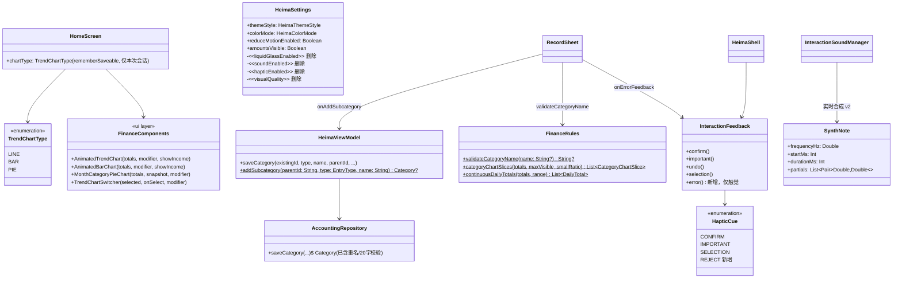
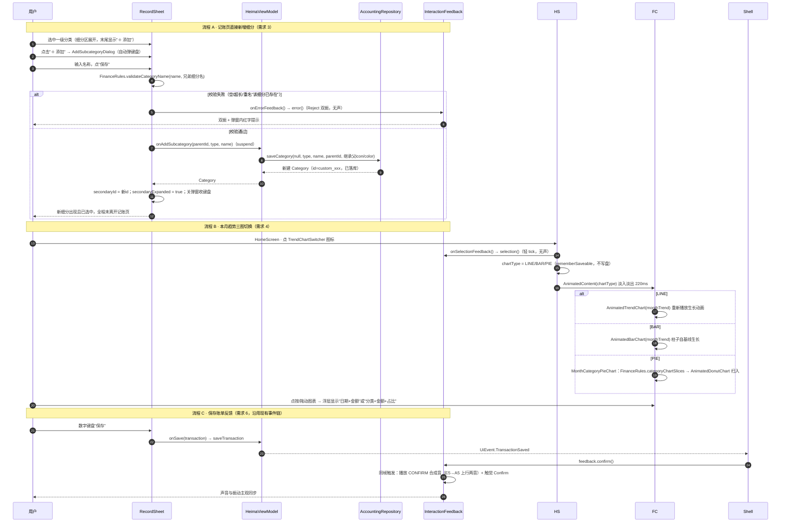
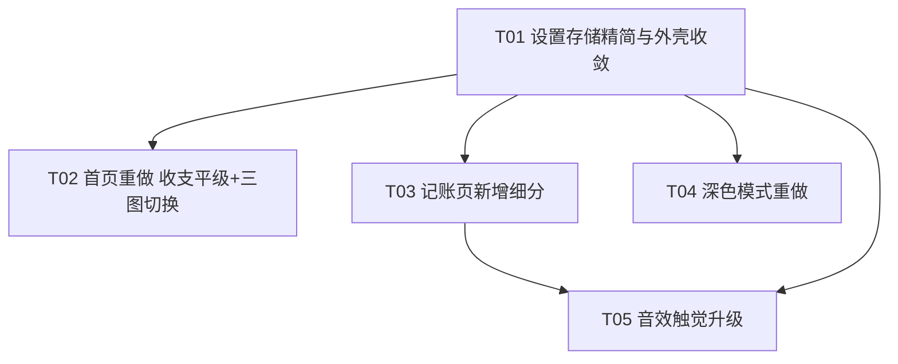

# 黑马记账 · 第一期 + 第二期增量架构设计

> 版本：v1.0（架构定稿，可直接交工程师实施）
> 依据：`docs/android/PRD_PHASE1_2.md` + `docs/android/NEXT_IMPROVEMENT_PLAN.md`
> 范围：需求 1（收支平级）/ 2（设置简化）/ 3（细分直加）/ 4（三图切换）/ 5（深色重做）/ 6（音效触觉升级）
> 原则：**最小改动、不推翻现有架构**；全部改动落在既有文件内，本期 **0 个新增源码文件**。

---

## 一、实现方案总览

| # | 需求 | 核心技术点 | 选型与做法 | 量级 |
|---|------|-----------|-----------|------|
| 1 | 首页收支平级 + 今日结余 | Compose 布局重排 | 纯 UI 重排，复用 `SensitiveAmountText` 与 `FinanceSummary.balanceCents`，零逻辑新增 | 小 |
| 2 | 体验设置简化 | 设置存储裁剪 | `HeimaSettings` 删除 4 个字段，默认值在 `HeimaApp` 层硬编码为"最佳配置"；SharedPreferences 残留旧 key 自然失效，无需迁移代码 | 小 |
| 3 | 记账页直接新增细分 | 复用既有分类保存链路 | 复用 `AccountingRepository.saveCategory`（已含重名/长度校验，返回 `Category`）；ViewModel 新增一个 `suspend` 方法返回新建对象供 UI 自动选中；弹窗复用 `internal HeimaDialogFrame` | 小 |
| 4 | 三图切换 + 动效 | Compose Canvas + AnimatedContent | 折线图复用 `AnimatedTrendChart`；新增 `AnimatedBarChart`（镜像折线图实现）与 `TrendChartSwitcher`；饼图复用 `AnimatedDonutChart` + `FinanceRules.categoryChartSlices`；切换用 `AnimatedContent` 淡入淡出 | 中 |
| 5 | 深色模式重做 | 设计 Token 调参 | 只改 `HeimaTheme.kt` 两张深色配色表 + `Glass.kt`/`MotionMaterial.kt` 深色参数，浅色两套 Token 一字不动 | 中 |
| 6 | 音效触觉升级 | PCM 实时合成（沿用现有 writeMicroSound 思路） | 继续 SoundPool + 缓存 wav 方案，升级合成算法（泛音叠加 + 微失谐 + 快速起音/指数衰减包络 + 两音序列）；缓存文件名升 v2 强制重新生成；不引入任何音频资源文件 | 中 |

**关键技术挑战与对策：**

1. **三图切换不跳高**：三种图统一放进固定高度（150.dp）的 `Box`，`AnimatedContent` 仅做透明度过渡、不做尺寸动画，卡片高度恒定。
2. **细分"保存即选中"**：现有 `HeimaViewModel.saveCategory` 是"发射后不管"，拿不到新分类 id。新增 `suspend fun addSubcategory(...)` 直接返回 `repository.saveCategory(...)` 的产物，`RecordSheet` 用 `rememberCoroutineScope` 等待结果后置 `secondaryId`。
3. **老用户升级不崩**：被删的 4 个设置字段仅从数据类移除，SharedPreferences 里的旧值变成"无人读取的死 key"，不影响打开；保留的字段（主题/减少动态/金额可见）读写路径完全不变。
4. **深色对比度达标**：所有深色文字 Token 给出具体色值并按 WCAG AA 验算（见第五节），工程师落地后真机抽查。

---

## 二、文件列表（全部为修改，无新增文件）

| 文件（相对 `apps/android/`） | 改动内容 | 关联需求 |
|---|---|---|
| `app/.../ui/screens/HomeScreen.kt` | HERO 卡重排（消费/收入平级 + 结余）；本月趋势卡改整行 + 三图切换；新增 `chartType` 状态与 `onSelectionFeedback` 参数 | 1、4 |
| `app/.../ui/FinanceComponents.kt` | 新增 `TrendChartType` 枚举、`AnimatedBarChart`、`TrendChartSwitcher`、`MonthCategoryPieChart` | 4 |
| `app/.../ui/screens/RecordSheet.kt` | 细分区常驻"＋ 添加"入口 + `AddSubcategoryDialog`；新增 `onAddSubcategory` / `onErrorFeedback` 参数；校验失败触发错误反馈 | 3、6 |
| `app/.../ui/screens/ProfileScreen.kt` | 删除 4 个开关与 `QualityRow`、省电提示文案；签名精简 | 2 |
| `app/.../SettingsRepository.kt` | `HeimaSettings` 删除 `liquidGlassEnabled / soundEnabled / hapticEnabled / visualQuality` 四字段及读写 | 2 |
| `app/.../HeimaViewModel.kt` | 删除 4 个 setter；新增 `suspend fun addSubcategory` | 2、3 |
| `app/.../ui/HeimaApp.kt` | 音效/触觉/玻璃开关硬编码 `true`；`effectiveQuality` 改为"默认精美、省电/过热自动降级" | 2 |
| `app/.../ui/HeimaShell.kt` | 签名精简；无障碍描述精简；`HomeScreen`/`RecordSheet` 新参数接线（`feedback::selection`、`feedback::error`、`viewModel::addSubcategory`） | 1、2、3、4、6 |
| `core/designsystem/.../HeimaTheme.kt` | `LiquidDark`、`NatureDark` 两套 Token 全量新色值 | 5 |
| `core/designsystem/.../Glass.kt` | 深色下阴影/高光/描边/sheen 参数调整 | 5 |
| `core/designsystem/.../MotionMaterial.kt` | 深色下 `highlightAlpha` / `innerShadowAlpha` 各 Role 参数上调 | 5 |
| `app/.../ui/InteractionFeedback.kt` | 合成算法重写（v2）；新增 `HapticCue.REJECT` 与 `InteractionFeedback.error()`；SoundPool 流数 2→4；播放防抖 | 6 |

---

## 三、数据结构与接口

### 3.1 类图



### 3.2 新增/变更接口签名

**FinanceComponents.kt（新增，包 `com.heima.accounting.ui`）：**

```kotlin
enum class TrendChartType { LINE, BAR, PIE }

/** 柱状图：镜像 AnimatedTrendChart 的动画/交互（生长动画 + 点按/拖动选中 + 右上浮层数值）。 */
@Composable
fun AnimatedBarChart(
    totals: List<DailyTotal>,
    modifier: Modifier = Modifier,
    showIncome: Boolean = false,
)

/** 饼图：包装 AnimatedDonutChart，自带选中态与"分类名 ¥金额 · 占比"标签。 */
@Composable
fun MonthCategoryPieChart(
    totals: List<CategoryTotal>,
    snapshot: LedgerSnapshot,
    modifier: Modifier = Modifier,
)

/** 三图切换器：三个 32.dp 图标位，选中项主色高亮 + 品牌色浅底圆。 */
@Composable
fun TrendChartSwitcher(
    selected: TrendChartType,
    onSelect: (TrendChartType) -> Unit,
    modifier: Modifier = Modifier,
)
```

**HomeScreen.kt：** 签名追加一个参数（放最后，带默认值以控制爆炸半径）：

```kotlin
fun HomeScreen(
    ...,                                 // 现有参数不变
    onSelectionFeedback: () -> Unit = {}, // 图表切换轻 tick
)
```

**RecordSheet.kt：** 追加两个参数：

```kotlin
fun RecordSheet(
    ...,                                        // 现有参数不变
    onAddSubcategory: suspend (parentId: String, type: EntryType, name: String) -> Category? = { _, _, _ -> null },
    onErrorFeedback: () -> Unit = {},           // 校验失败：Reject 双振，不发声
)
```

**HeimaViewModel.kt（新增方法）：**

```kotlin
/** 供记账页"＋添加细分"使用：直接返回新建分类，便于 UI 自动选中。失败返回 null（错误文案经 UiEvent.Message 下发）。 */
suspend fun addSubcategory(parentId: String, type: EntryType, name: String): Category? =
    runCatching {
        repository.saveCategory(
            existingId = null,
            type = type,
            name = name,
            parentId = parentId,
            iconKey = repository.parentIconOf(parentId),  // 见 3.3 注
        )
    }.onFailure { mutableEvents.emit(UiEvent.Message(it.message ?: "操作没有完成，请再试一次")) }
     .getOrNull()
```

**FinanceRules.kt（新增纯函数，供 RecordSheet 与未来复用）：**

```kotlin
/** 返回 null 表示合法；否则返回面向用户的错误文案。规则与 AccountingRepository.saveCategory 保持一致。 */
fun validateCategoryName(name: String?, existingSiblingNames: List<String> = emptyList()): String? {
    val normalized = name.orEmpty().trim()
    if (normalized.isEmpty()) return "请输入名称"
    if (normalized.length > 20) return "名称最长 20 个字"
    if (existingSiblingNames.any { it.trim().equals(normalized, ignoreCase = true) }) return "该细分已存在"
    return null
}
```

**InteractionFeedback.kt（变更）：**

```kotlin
internal enum class InteractionSound { CONFIRM, IMPORTANT, UNDO }          // 不变
internal enum class HapticCue { CONFIRM, IMPORTANT, SELECTION, REJECT }    // +REJECT

class InteractionFeedback {
    fun confirm()   // 保存成功：音效 CONFIRM + 触觉 CONFIRM
    fun important() // 删除/重要：音效 IMPORTANT + 触觉 IMPORTANT(LongPress)
    fun undo()      // 撤销：音效 UNDO + 触觉 CONFIRM
    fun selection() // 常规选择：仅触觉 SELECTION(轻 tick)，无声
    fun error()     // 新增：校验失败——仅触觉 REJECT（双振），无声
}
```

### 3.3 领域与存储

- `Category`、`Transaction`、`FinanceSummary` 等领域模型 **零改动**；结余直接用现有 `FinanceSummary.balanceCents`（= 收入 − 支出）。
- 新增细分的 `iconKey` / `colorArgb` 继承父分类（与 `ManagementScreens` 的"添加二级分类"一致）。实现上 `RecordSheet` 已从 `snapshot.category(parentId)` 拿到父分类，**直接在 UI 层把父分类的 iconKey/colorArgb 传入回调**，`AccountingRepository` 无需新增方法（3.2 中 `parentIconOf` 仅为示意，落地时改为参数透传，回调签名实为 `suspend (parentId, type, name, iconKey, colorArgb) -> Category?`，或简化为直接传整个父 `Category`）。
- `HeimaSettings` 删字段后 SharedPreferences 残留 key 不清理、不报错。

---

## 四、程序调用流

### 4.1 时序图



### 4.2 图表组件设计要点（需求 4 落地细则）

- **状态**：`HomeScreen` 内 `var chartType by rememberSaveable { mutableStateOf(TrendChartType.LINE) }`。主理人已拍板**不持久化**；`rememberSaveable` 保证切 Tab/旋屏/后台回收后本次会话内不重置（`HomeScreen` 本身还在 `SaveableStateProvider("main_HOME")` 内，双重保险）。
- **布局**：原"本月趋势 + 剩余预算"并排 Row 拆为两个 item——趋势卡升级为**整行**（`role = HeimaSurfaceRole.CHART`，内高固定 150.dp 图表区），预算卡紧随其后整行展示。卡片标题行右侧放 `TrendChartSwitcher`。
- **过渡动画**：`AnimatedContent(targetState = chartType, transitionSpec = fadeIn(tween(220, delayMillis = 90)) togetherWith fadeOut(tween(130)))`；`reduceMotion` 时双向都降为 `tween(90)` 纯淡入淡出。因图表区高度固定，**禁用尺寸动画**，卡片不跳高、不闪白。每个图表组件内部的"生长"动画由其自身 `remember(key)` 驱动，切进来自然重播。
- **AnimatedBarChart 绘制**：基线同折线图；柱宽 = `size.width / totals.size × 0.56`，相邻柱居中于各自刻度；柱顶圆角 3.dp；生长动画用 `progress` 缩放柱高（自基线向上）；选中柱用 `palette.brand` 实心、未选中 `copy(alpha = .55f)`；点按/拖动按 x 坐标求 index（与折线图同一公式）；右上浮层 `"M月d日  ¥xx.xx"`。
- **MonthCategoryPieChart**：`slices = FinanceRules.categoryChartSlices(totals)`（占比和恒为 100%，口径与统计页一致）；`colors = palette.chartColors`；中心标题"本月支出"、副标题合计金额；选中 slice 时下方显示 `"分类名  ¥金额 · NN%"`（"其他" slice 显示"其他"）。
- **空状态（D6）**：`monthSummary.expenseCents == 0L` 时三种图统一显示居中文案"本月暂无消费"，不渲染图形。
- **触觉**：切换图标点击走 `onSelectionFeedback()`（轻 tick、无声，符合规格表"图表切换"行）。

---

## 五、深色配色方案（需求 5）

### 5.1 LiquidDark（澄澈蓝 · 深色）新旧对照

三层明度：**background（最暗）< surface（卡片）< surfaceElevated（浮层）**，通道差 ≥ 0x0C，肉眼可辨。

| Token | 旧值 | 新值 | 理由 |
|---|---|---|---|
| background | `0xFF0C121C` | `0xFF0B101A` | 压暗底色，给上层留拉开空间 |
| backgroundSecondary | `0xFF111B29` | `0xFF101826` | 跟随背景同步下移 |
| surface | `0xFF151E2B` | `0xFF182334` | 普通卡片提亮一档，与背景差 ≈0x0D/0x13/0x1A |
| surfaceElevated | `0xFF1B2635` | `0xFF223148` | 浮起卡片再亮一档（弹层/底面板"浮在暗处"） |
| surfaceVariant | `0xFF222F40` | `0xFF2A3A52` | 轨道/底色同步上移保持层级 |
| outline | `0xFF445269` | `0xFF4A5A74` | 描边在新表面上保持可见 |
| glassBase | `0xE61B2737` | `0xE6202C40` | 玻璃底色对齐新 surface |
| glassTint | `0xD9233144` | `0xD9283850` | 同上，底部渐变端 |
| glassHighlight | `0x24D8E8FF` | `0x2EDCEAFF` | 高光略升，配合 Glass.kt 收敛到上边缘 |
| glassOutline | `0x33BFD5F4` | `0x40C7DBF7` | 描边不透明度 0x33→0x40，深色下勾边"看得见" |
| glassShadow | `0x8A05080E` | `0x9903070C` | 阴影加深（不透明度 0x8A→0x99） |
| brand | `0xFF76A4FF` | `0xFF8AB2FF` | 主色提亮 ≈14%（R 通道 +0x14），深色下选中态醒目 |
| brandSoft | `0xFF263C68` | `0xFF2A4270` | 跟随主色微调 |
| accent | `0xFF81C8FF` | `0xFF8FD0FF` | 提亮 ≈9% |
| positiveColor | `0xFF61D4A7` | `0xFF6CDDB2` | 收入绿提亮 ≈10%，不荧光 |
| negativeColor | `0xFF83A9FF` | `0xFF8FB2FF` | 支出色提亮 ≈8%（本项目支出用蓝系，非红色） |
| warningColor | `0xFFF2C46D` | `0xFFF5CC7A` | 微提亮 |
| textPrimary | `0xFFF5F7FC` | `0xFFF2F5FA` | 接近白但非纯白（#FFFFFF 刺眼），对比度 >13:1 |
| textSecondary | `0xFFBEC7D6` | `0xFFC3CCD9` | 提亮，surface 上对比度 ≈9:1 |
| textMuted | `0xFF8C98AA` | `0xFF97A2B4` | 提亮至 surfaceElevated 上对比度 ≈4.8:1（AA 达标） |
| divider | `0x24FFFFFF` | `0x29FFFFFF` | 微升 |
| ambientOne | `0xFF1C3760` | `0xFF1E3B66` | 氛围光斑随主色微移 |
| ambientTwo | `0xFF173646` | `0xFF1A3A4C` | 同上 |
| chartColors[0] | `0xFF7EA7FF` | `0xFF8AB2FF` | 图表色统一提亮 ≈10~15%，与主色同族 |
| chartColors[1] | `0xFF51D2B4` | `0xFF5CD8BC` | ↑ |
| chartColors[2] | `0xFFFFBB78` | `0xFFFFC284` | ↑ |
| chartColors[3] | `0xFFBE91FF` | `0xFFC69AFF` | ↑ |
| chartColors[4] | `0xFFFF8EAA` | `0xFFFF97B2` | ↑ |
| chartColors[5] | `0xFFA7B1C5` | `0xFFB0BAC9` | ↑ |

### 5.2 NatureDark（自然治愈 · 深色）新旧对照

| Token | 旧值 | 新值 | 理由 |
|---|---|---|---|
| background | `0xFF101712` | `0xFF0D130E` | 压暗底色 |
| backgroundSecondary | `0xFF162119` | `0xFF131C15` | 同步下移 |
| surface | `0xFF1A251E` | `0xFF1C2820` | 卡片层 |
| surfaceElevated | `0xFF202D25` | `0xFF26352C` | 浮起层，与 surface 差 ≈0x0A/0x0D/0x0C |
| surfaceVariant | `0xFF28372D` | `0xFF2E4034` | 同步上移 |
| outline | `0xFF465A4C` | `0xFF4E6355` | 描边可见性 |
| glassBase | `0xE3213027` | `0xE324332A` | 对齐新 surface |
| glassTint | `0xD1283A2F` | `0xD92C4033` | 同上 |
| glassHighlight | `0x20DFF5E5` | `0x28E2F7E9` | 高光微升 |
| glassOutline | `0x31C9E0CF` | `0x3ACFE6D6` | 勾边增强 |
| glassShadow | `0x8A050A06` | `0x99040805` | 阴影加深 |
| brand | `0xFF91C7A2` | `0xFFA0D5B1` | 主色提亮 ≈10%（绿系保持"治愈"不发荧光） |
| brandSoft | `0xFF294735` | `0xFF2D5039` | 跟随 |
| accent | `0xFFADD19F` | `0xFFB8DBAB` | 提亮 ≈8% |
| positiveColor | `0xFF83D0A8` | `0xFF8DD7B2` | 收入绿提亮 |
| negativeColor | `0xFFE1A47C` | `0xFFE8AE84` | 支出陶土色提亮 |
| warningColor | `0xFFE3BC70` | `0xFFE8C47C` | 微提亮 |
| textPrimary | `0xFFF3F5EE` | `0xFFF1F4EC` | 近白非纯白 |
| textSecondary | `0xFFC6CEC2` | `0xFFCBD3C6` | 提亮 |
| textMuted | `0xFF949E92` | `0xFF9DA896` | surfaceElevated 上对比度 ≈4.6:1（AA） |
| divider | `0x24FFFFFF` | `0x29FFFFFF` | 微升 |
| ambientOne | `0xFF27452F` | `0xFF2A4C34` | 氛围光斑随主色 |
| ambientTwo | `0xFF2C4432` | `0xFF304B38` | 同上 |
| chartColors[0] | `0xFF8AC8A0` | `0xFF95D0AA` | 图表色统一提亮 ≈10% |
| chartColors[1] | `0xFF91C7C0` | `0xFF9ACEC6` | ↑ |
| chartColors[2] | `0xFFE8AD7C` | `0xFFEDB586` | ↑ |
| chartColors[3] | `0xFFC29DDF` | `0xFFC8A5E4` | ↑ |
| chartColors[4] | `0xFFE39AA2` | `0xFFE7A2AA` | ↑ |
| chartColors[5] | `0xFFAEBBAA` | `0xFFB5C2B1` | ↑ |

**浅色两套（LiquidLight / NatureLight）不改动任何值**（验收 E5）。

### 5.3 Glass.kt / MotionMaterial.kt 深色参数调整

`Glass.kt`（仅 `material.darkTheme` 分支）：

| 位置 | 旧 | 新 | 说明 |
|---|---|---|---|
| `.shadow(ambientColor alpha)` | `.30f` | `.42f` | 阴影加深、浮起感增强 |
| `drawBackdrop Shadow(alpha)` | `.12f` | `.20f` | 实时模糊路径同步加深 |
| rim 渐变白高光两段 alpha | `0.24f / 0.14f` | `0.30f / 0.18f` | 高光"看得见但不刺眼"，仍远低于浅色 0.72/0.36 |
| 上边缘高光线 alpha | `0.20f` | `0.30f` | 高光收敛到上边缘（本来就只画顶部 1.2.dp 一线） |
| sheen 径向高光 alpha | `0.025f` | `0.045f` | 玻璃内部微光略增 |

`MotionMaterial.kt`（`HeimaMaterialSystem.spec` 的 `dark` 分支）：

| Role | highlightAlpha 旧→新 | innerShadowAlpha 旧→新 |
|---|---|---|
| HERO | `.07f → .10f` | `.05f → .07f` |
| INSIGHT | `.06f → .09f` | `.04f → .06f` |
| OVERLAY | `.05f → .08f` | `.05f → .07f` |
| METRIC / CHART / LIST / INTERACTIVE | `.045f → .07f` | `.03f → .05f` |

---

## 六、音效合成算法设计（需求 6）

### 6.1 总体方案

沿用现有 `InteractionSoundManager`（SoundPool + 首次运行合成 wav 缓存到 `cacheDir/interaction-sounds/`），**只重写波形合成函数**。缓存文件名升级 `-v2.wav` 强制老设备重新生成；不引入音频资源文件；采样参数不变（22050Hz / 16bit / 单声道）。

### 6.2 合成公式

每个音符（`SynthNote`）：

```
s(t) = env(t) · Σᵢ ampᵢ · sin(2π · f · ratioᵢ · t)      t ∈ [0, durationMs]
```

**泛音表（明亮族，CONFIRM / UNDO 用）：**

| 分音 i | ratioᵢ | ampᵢ | 说明 |
|---|---|---|---|
| 基频 | 1.0000 | 1.00 | |
| 微失谐+ | 1.0016 | 0.55 | +2.8 音分，"暖感"合唱 |
| 微失谐− | 0.9986 | 0.55 | −2.4 音分 |
| 二泛音 | 2.0000 | 0.32 | 八度，明亮度 |
| 三泛音 | 3.0100 | 0.11 | 微偏避免机械感 |
| 四泛音 | 4.0300 | 0.05 | 空气感 |

归一化系数 = Σamp = 2.58。

**柔和族（IMPORTANT"闷响"用）：** `(1.0000, 1.00) (1.0016, 0.45) (0.9986, 0.45) (2.0000, 0.42) (3.0100, 0.06) (4.0300, 0.02)` —— 增强二次泛音、砍高频，听感圆润不发尖。

**包络 env(t)：**

```
attack = 6ms（IMPORTANT 8ms），线性 0→1
decay  = exp(−(t − attack) / τ)，τ = durationMs / 4.2（IMPORTANT 用 /3.6，收尾更圆）
末尾 10ms 叠加 raised-cosine 淡出到 0（杜绝爆音/拖尾杂音）
```

**响度：** 合成峰值 `masterAmplitude = 0.45`（归一化后），SoundPool 播放音量按事件 0.22~0.26 → 有效峰值 ≈ 0.10~0.12 满幅 ≈ **−18.6dB ~ −20dB**，落在规格要求的 −18~−24dB 区间。

### 6.3 各事件参数表

| 事件 | 音符序列（频率 / 起始 / 时长） | 泛音族 | 总时长 | SoundPool 音量 | 触觉 |
|---|---|---|---|---|---|
| CONFIRM 保存成功 | E5 659.26Hz / 0ms / 120ms → A5 880.00Hz / 90ms / 160ms（上行纯四度，30ms 交叠） | 明亮 | 250ms | 0.26 | Confirm |
| IMPORTANT 删除/重要 | C4 261.63Hz / 0ms / 190ms（单音低中频闷响） | 柔和 | 190ms | 0.24 | LongPress |
| UNDO 撤销 | A5 880.00Hz / 0ms / 110ms → E5 659.26Hz / 85ms / 140ms（下行，与 CONFIRM 镜像） | 明亮 | 225ms | 0.25 | Confirm |
| ERROR 校验失败 | **不发声**（振动主导，规格表允许省略） | — | — | — | Reject ×2（间隔 100ms） |
| SELECTION 常规选择 | 无声 | — | — | — | TextHandleMove（轻 tick，现有） |

**Kotlin 落地接口（在 InteractionFeedback.kt 内）：**

```kotlin
private data class SynthNote(
    val frequencyHz: Double,
    val startMs: Int,
    val durationMs: Int,
    val partials: List<Pair<Double, Double>>,   // (ratio, amp)
    val attackMs: Int = 6,
    val decayDivisor: Double = 4.2,
)

private val BrightPartials = listOf(1.0000 to 1.00, 1.0016 to 0.55, 0.9986 to 0.55, 2.0000 to 0.32, 3.0100 to 0.11, 4.0300 to 0.05)
private val SoftPartials   = listOf(1.0000 to 1.00, 1.0016 to 0.45, 0.9986 to 0.45, 2.0000 to 0.42, 3.0100 to 0.06, 4.0300 to 0.02)

private fun synthesizePcm(notes: List<SynthNote>, totalDurationMs: Int, masterAmplitude: Double = 0.45, sampleRate: Int = 22_050): ShortArray
private fun writeWav(file: File, pcm: ShortArray, sampleRate: Int = 22_050)  // 沿用现有 RIFF 头写法
```

### 6.4 工程细节

- **防叠爆（F8）**：SoundPool `maxStreams` 2→4；`play()` 内按事件记录上次播放时间，间隔 < 60ms 的直接丢弃。
- **声振同步（F7）**：保持现有 `emit()` 顺序（先 `playSound` 后 `performHaptic`，同帧调用）；SoundPool 预热加载，实测延迟 < 30ms，主观同步。
- **Reject 双振**：`performHaptic` 对 `REJECT` 用 `rememberCoroutineScope` 实现 `perform(Reject); delay(100); perform(Reject)`。`HapticFeedbackType.Reject` 与已在用的 `Confirm` 同属 Compose 1.7+ API；若编译期不存在则回退 `LongPress ×2`。
- **错误反馈接线**：`RecordSheet` 的三处校验失败（金额非法、未选分类、细分名非法）调用 `onErrorFeedback()`；`HeimaShell` 传 `feedback::error`。
- **默认开启（已拍板）**：`HeimaApp` 中 `rememberInteractionFeedback(soundEnabled = { true }, hapticEnabled = { true })`。

---

## 七、各需求实现要点补遗

### 需求 1 · 首页 HERO 卡（HomeScreen.kt 120-135 行重写）

```
GlassSurface(role = HERO)
└─ Column(padding 22/21)
   ├─ Row(fillMaxWidth)
   │  ├─ Column(weight 1f, 居中)：Text("今日消费", labelLarge, textSecondary) + SensitiveAmountText(expense, headlineLarge, textPrimary)
   │  └─ Column(weight 1f, 居中)：Text("今日收入", labelLarge, textSecondary) + SensitiveAmountText(income, headlineLarge, palette.income)
   ├─ Spacer(10.dp)
   └─ 居中 SensitiveAmountText(todaySummary.balanceCents, titleMedium, 结余色, prefix="今日结余  ", signed=true)
```

- 两个金额**同一样式** `MaterialTheme.typography.headlineLarge`（替代原 displayLarge 大字，保证等大不挤压）；过长金额依赖 `maxLines = 1` + 样式缩小（如需可包 `autoSize` 简化处理：金额超过 7 位时降级 titleLarge，本期可用 `if (cents >= 1_000_000_00) headlineMedium else headlineLarge` 一行搞定）。
- 结余色：`>0 → palette.income`；`<0 → palette.expense`；`=0 → palette.textSecondary`。零收入时收入位照常显示 `¥0.00`（`SensitiveAmountText` 天然支持），布局不抖。

### 需求 2 · 设置简化

- `ProfileScreen` 体验设置卡只留 `SettingToggle("减少动态效果", ...)`；删除 Liquid Glass/操作音效/触觉反馈三行与 `QualityRow`，以及"省电模式"提示文案（B4 要求静默降级）。`QualityRow` 与未再使用的私有 composable、相关参数一并删除。
- `HeimaSettings` 保留字段：`themeStyle / colorMode / reduceMotionEnabled / amountsVisible`。`SettingsRepository` 删除对应 key 读写与 setter；`HeimaViewModel` 删除 4 个透传 setter。
- `HeimaApp.effectiveQuality` 改为：`if (powerSaveMode || thermalStatus >= SEVERE) POWER_SAVER else REFINED`（默认精美、静默降级）；`liquidGlassEnabled = true` 直接传入主题。
- `HeimaShell` 删除 `liquidGlassEnabled / soundEnabled / hapticEnabled / visualQuality` 四个参数与对应回调，无障碍 `contentDescription` 只保留"减少动态效果"一项。

### 需求 3 · 记账页新增细分

- 一级分类选中后 `secondaryExpanded` 恒置 `true`（原逻辑为"有子分类才展开"），细分区 `AnimatedVisibility` 条件改为 `secondaryExpanded && selectedPrimary != null`。
- `FlowRow` 末尾追加"＋ 添加"chip：样式对齐 `GlassChip`，品牌色描边 + "＋ 添加"文案（虚线描边为理想态，Compose 无边框虚线 API，允许用 `palette.brand.copy(alpha = .6f)` 实线描边替代，已在 PRD 允许"可辨识即可"的范围内）。
- `AddSubcategoryDialog`（RecordSheet.kt 内 private）：复用 `internal HeimaDialogFrame` + `GlassFieldSurface` + `BasicTextField`（`take(20)` 截断）；弹出时 `FocusRequester` 自动唤起键盘；保存按钮在输入为空白时禁用。
- 保存链路：`validateCategoryName`（空→"请输入名称"；重名忽略大小写→"该细分已存在"）→ 失败 `onErrorFeedback()` + 弹窗内红字；成功 `scope.launch { onAddSubcategory(...)?.let { secondaryId = it.id } }` → 关弹窗、收键盘、`onSelectionFeedback()`。
- 重名最终防线仍是 `AccountingRepository.saveCategory` 的 `require`（"同一层级已经有这个分类"），双保险。

---

## 八、任务列表（交工程师执行）

> 共 5 个任务，全部 P0。T01 是参数/存储基础，必须先做；T02~T05 均只依赖 T01（T05 另依赖 T03 的 RecordSheet 改动面，排在 T03 后避免冲突）。

| 任务 | 名称 | 涉及文件 | 依赖 | 对应验收 |
|---|---|---|---|---|
| **T01** | 设置存储精简与外壳参数收敛（需求 2 基础层） | `SettingsRepository.kt`、`HeimaViewModel.kt`、`HeimaApp.kt`、`HeimaShell.kt`、`ProfileScreen.kt` | 无 | B1~B5 |
| **T02** | 首页重做：收支平级 + 今日结余 + 三图切换（需求 1、4） | `HomeScreen.kt`、`FinanceComponents.kt`、`HeimaShell.kt`（仅 HomeScreen 新参数接线） | T01 | A1~A6、D1~D7 |
| **T03** | 记账页直接新增细分（需求 3） | `RecordSheet.kt`、`HeimaViewModel.kt`（addSubcategory）、`FinanceRules.kt`（validateCategoryName） | T01 | C1~C6 |
| **T04** | 深色模式重做（需求 5） | `core/designsystem/HeimaTheme.kt`、`core/designsystem/Glass.kt`、`core/designsystem/MotionMaterial.kt` | T01 | E1~E6 |
| **T05** | 音效触觉升级（需求 6） | `InteractionFeedback.kt`、`HeimaShell.kt`（feedback::error 接线）、`RecordSheet.kt`（onErrorFeedback 三处调用） | T01、T03 | F1~F8 |

**任务依赖图：**



**每任务验收动作**：完成后 `gradlew.bat :app:assembleDebug` 编译通过；T04/T05 必须真机（或 MuMu）主观确认。

---

## 九、共享约定（跨文件统一）

1. **深色层级表达**：浮起一律用更亮的 `surfaceElevated` Token，禁止用"叠加白雾/白色半透明层"表达浮起；三层顺序 `background < surface < surfaceElevated` 不得倒置。
2. **浅色零改动**：本期任何深色调整不得触碰 `LiquidLight` / `NatureLight` 两个 Token 表的任何数值。
3. **金额**：永远以"分"（Long）计算，展示统一走 `Long.formatYuan()` / `SensitiveAmountText`；结余直接用 `FinanceSummary.balanceCents`，不新造口径。标题固定写"今日结余"。
4. **动画**：所有新动画必须读取 `HeimaTheme.motion.reduceMotion`，开启时降级为 ≤90ms 淡入淡出；时长 token 用 `HeimaMotionTokens`。
5. **反馈统一入口**：UI 一律经 `InteractionFeedback`（confirm/important/undo/selection/error）触发声振，禁止直接碰 SoundPool / HapticFeedback；常规点击无声只有轻 tick；只有"完成/失败某件事"才允许发声或重振。
6. **图表选中态**：图表类型、图表内选中点/扇区均为会话级 `rememberSaveable` / `remember`，**本期一律不写盘**。
7. **分类名称规则**：上限 20 字符、同级重名禁止（忽略大小写比较后提示"该细分已存在"）；校验逻辑集中在 `FinanceRules.validateCategoryName`，存储层 `require` 兜底，UI 不得各写各的。
8. **无障碍**：所有新增可点控件必须带 `contentDescription`（中文），沿用现有写法。

---

## 十、待明确事项

1. **预算卡布局变化**：趋势卡升整行后，"剩余预算"卡改为整行独立展示（原为半行并排）。视觉占比变化已属本期必要的最小重排，默认接受；如主理人希望保持并排需另议（半行宽度放不下饼图交互，不建议）。
2. **`HapticFeedbackType.Reject` 可用性**：与现有 `Confirm` 同版本引入（Compose 1.7+），编译验证若缺失则回退 `LongPress ×2`（间隔 100ms），验收口径不变。
3. **深色对比度数值**为按 sRGB 相对亮度估算，落地后需用对比度工具 + 真机抽查（E2/E3 为感观项）。
4. **金额超大显示**：今日收支达 7 位数（万元级）时的字号降级策略给了简化实现（第三节需求 1 补遗），如需更精细的 autosize 可第三期再做。
5. **"＋ 添加"chip 虚线描边**：Compose 无原生虚线边框，本期用品牌色实线描边替代；坚持虚线需自绘 `drawBehind` PathEffect，工作量小但非必须，待拍板。
