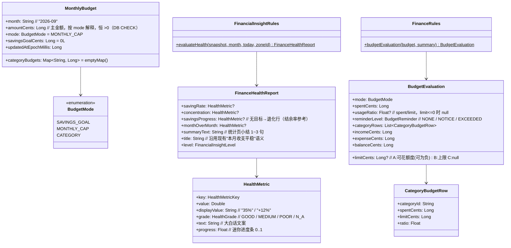
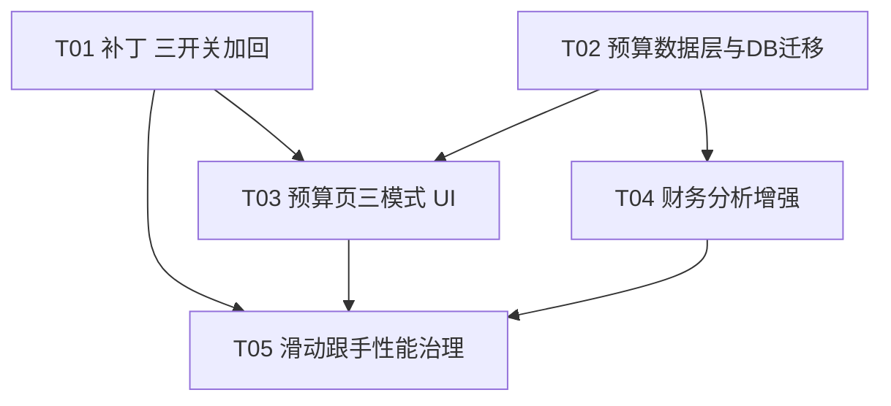

# 黑马记账 · 二期补丁 + 三期增量架构设计

> 版本：v1.0（架构定稿，可直接交工程师实施）
> 依据：`docs/android/PRD_PHASE3.md` + `docs/android/PHASE3_4_PLAN.md`（0. 二期补丁 / 一、三期 / 四、已拍板结果）+ 主理人 6 项拍板
> 原则：**最小改动、不推翻现有架构、老数据一分不丢**。
> 现状基线：一期+二期已交付（设置 4 字段已删、InteractionFeedback 泛音合成 v2、三图切换已上线、深色已重做）。

---

## 一、实现方案总览

| # | 需求 | 核心技术点 | 选型与做法 | 量级 |
|---|------|-----------|-----------|------|
| 补丁 | 加回 3 个设置开关 | 设置存储恢复 | `HeimaSettings` 加回 `soundEnabled / hapticEnabled / liquidGlassEnabled` 三字段，**SharedPreferences key 沿用一期原名**（`sound_enabled` / `haptic_enabled` / `liquid_glass_enabled`）——二期只是删了字段没删数据，老用户的旧值天然还在，恢复同名字段即自动读回（验收 A6 零成本） | 小 |
| 3.1 | 滑动跟手 | 滚动感知的渲染降级 | 新增 `LocalHeimaScrolling` CompositionLocal（由各 LazyColumn 的 `isScrollInProgress` 驱动）；`GlassSurface` 滚动中强制走"静态渐变底色"路径并跳过 rim 高光描边；图表生长动画滚动中暂停、停止后续播。**滚动中 vs 静止差异化**，观感几乎不变 | 中 |
| 3.2 | 财务分析增强 | 纯函数规则引擎 | `FinancialInsightRules` 新增 `evaluateHealth()`，输出 4 维度结构化指标（结余率 / 支出集中度 / 储蓄进度 / 环比）+ 合成小结文本；首页卡换体检卡（迷你进度条），统计页顶部加小结卡；不新增数据依赖（全用内存 snapshot） | 中 |
| 3.3 | 预算三模式 | 数据库 schema 迁移 + 领域计算 | `MonthlyBudget` 扩展三字段；**SQLite ALTER TABLE 增列迁移 v2→v3**（不动旧列、不重建表，老数据零风险）；新 `saveBudget(MonthlyBudget)`；`FinanceRules.budgetEvaluation()` 统一三模式计算；预算页重排为模式切换 + 三套指标区 | 中偏大 |

**关键技术挑战与对策：**

1. **数据库迁移零丢失**：现状是裸 `SQLiteOpenHelper`（非 Room），版本 2，迁移链模式（`onUpgrade` while 循环 + `schema_migrations` 表）。预算表有 `CHECK(amount_cents > 0)` 约束——SQLite 无法改 CHECK，**不重建表**，用 `ALTER TABLE ADD COLUMN` 增列 + 默认值即可，旧行自动获得 `mode='MONTHLY_CAP'` 且金额原样保留（拍板 2，天然幂等）。
2. **amount_cents 语义冲突**：受 CHECK 约束必须恒 >0。设计为"**主金额**"按模式解释：MONTHLY_CAP→整月上限；SAVINGS_GOAL→冗余存储蓄目标；CATEGORY→冗余存"已设分类额度合计"（未设任何额度前不允许切到该模式保存）。语义映射表见 3.2 节。
3. **储蓄进度退化**（拍板 3）：无储蓄目标时，体检卡"储蓄进度"行改标"本月结余率参考"，直接复用结余率口径，4 行结构恒定、不出空态。
4. **滚动中禁模糊不闪变**：`GlassSurface` 的降级路径（静态渐变）与静止路径使用同一套 Token 与透明度公式，肉眼观感对齐；降级/恢复仅发生在滚动开始/结束各一次重组（`derivedStateOf` 收敛）。

---

## 二、文件列表

> 路径省略公共前缀 `apps/android/`；`app/.../` = `app/src/main/java/com/heima/accounting/`。

| 文件 | 新增/修改 | 改动内容 | 关联 |
|---|---|---|---|
| `app/.../SettingsRepository.kt` | 修改 | `HeimaSettings` 加回 3 字段 + 读写 + setter（key 恢复原名） | 补丁 |
| `app/.../HeimaViewModel.kt` | 修改 | 恢复 3 个设置 setter；`saveBudget` 换新签名 | 补丁、3.3 |
| `app/.../ui/screens/ProfileScreen.kt` | 修改 | 体验设置区加回 3 个 toggle（操作音效/触觉反馈/Liquid Glass） | 补丁 |
| `app/.../ui/HeimaApp.kt` | 修改 | `rememberInteractionFeedback` 恢复读 settings；`liquidGlassEnabled` 恢复透传 | 补丁 |
| `app/.../ui/HeimaShell.kt` | 修改 | 恢复 3 参数与接线；`BudgetScreen` 传新签名回调 | 补丁、3.3 |
| `core/domain/.../Models.kt` | 修改 | `BudgetMode` 枚举；`MonthlyBudget` 扩展 `mode / savingsGoalCents / categoryBudgets` | 3.3 |
| `core/database/.../HeimaDatabase.kt` | 修改 | 版本 2→3；`migrateTwoToThree()`（3 条 ALTER TABLE）；`upsertBudget / readBudgets / replaceAll / BUDGET_COLUMNS / budgetFromCursor` 适配新列；新增 `MonthlyBudget.categoryBudgetsJson` 序列化 | 3.3 |
| `core/data/.../AccountingRepository.kt` | 修改 | `saveBudget(MonthlyBudget)`（三模式校验）；读路径不变 | 3.3 |
| `core/data/.../BackupCodec.kt` | 修改 | 预算 JSON 加新字段（encode 必写、decode 用 `opt` 兼容旧备份）；校验规则扩展 | 3.3 |
| `core/domain/.../FinanceRules.kt` | 修改 | 新增 `BudgetEvaluation` 与 `budgetEvaluation()` 三模式计算 | 3.3 |
| `core/domain/.../FinancialInsightRules.kt` | 修改 | 新增 `FinanceHealthReport / HealthMetric / evaluateHealth()`；`evaluate()` 由 `evaluateHealth()` 取代（同步改单测） | 3.2 |
| `app/.../ui/screens/BudgetScreen.kt` | 修改 | 重排：三联模式切换 + 模式 A/B/C 三套指标区与编辑入口 | 3.3 |
| `app/.../ui/screens/HomeScreen.kt` | 修改 | "财务状态"卡 → "财务体检"卡（4 行指标 + 迷你进度条）；"剩余预算"卡按模式适配口径 | 3.2、3.3 |
| `app/.../ui/screens/StatisticsScreen.kt` | 修改 | 顶部新增"财务小结"卡（单自然月范围时显示该月小结）；接入 `LocalHeimaScrolling` | 3.2、3.1 |
| `app/.../ui/screens/ManagementScreens.kt` | 修改 | 账单列表接入 `LocalHeimaScrolling` | 3.1 |
| `app/.../ui/FinanceComponents.kt` | 修改 | 三个图表组件生长动画接入"滚动中暂停、停止续播" | 3.1 |
| `core/designsystem/.../Glass.kt` | 修改 | 新增 `LocalHeimaScrolling`；滚动中禁 backdropBlur、跳过 rim/顶边高光；阴影策略微调 | 3.1 |
| `core/domain/.../FinancialInsightRulesTest.kt` | 修改 | 适配 `evaluateHealth()` 并补 4 维度分档用例 | 3.2 |

**无新增源码文件**（`LocalHeimaScrolling` 放 designsystem 模块的 `Glass.kt` 顶部，不单开文件）。

---

## 三、数据结构与接口

### 3.1 类图（本期增量）



### 3.2 预算三模式（3.3）

**领域模型（`core/domain/Models.kt`）：**

```kotlin
enum class BudgetMode { SAVINGS_GOAL, MONTHLY_CAP, CATEGORY }

data class MonthlyBudget(
    val month: String,
    val amountCents: Long,                                  // 主金额，恒 >0
    val mode: BudgetMode = BudgetMode.MONTHLY_CAP,          // 老数据默认 MONTHLY_CAP（拍板 2）
    val savingsGoalCents: Long = 0L,                        // SAVINGS_GOAL 模式的储蓄目标
    val categoryBudgets: Map<String, Long> = emptyMap(),    // CATEGORY 模式：支出一级分类 id → 额度（分）
    val updatedAtEpochMillis: Long = System.currentTimeMillis(),
)
```

**主金额语义映射表（受 DB `CHECK(amount_cents > 0)` 约束的设计）：**

| 模式 | amount_cents 存什么 | 谁消费它 |
|---|---|---|
| MONTHLY_CAP | 整月上限 | gauge / 剩余预算卡 |
| SAVINGS_GOAL | 冗余 = savingsGoalCents | 仅 DB 约束满足；计算一律读 savingsGoalCents |
| CATEGORY | 冗余 = 已设分类额度合计 | 仅 DB 约束满足；计算一律读 categoryBudgets |

**数据库迁移（`core/database/HeimaDatabase.kt`，DATABASE_VERSION 2 → 3）：**

```kotlin
private fun migrateTwoToThree(db: SQLiteDatabase) {
    // 只增列、不改旧列、不重建表：旧行自动获得默认值，amount_cents 原样保留（老数据零丢失）。
    db.execSQL("ALTER TABLE monthly_budgets ADD COLUMN mode TEXT NOT NULL DEFAULT 'MONTHLY_CAP'")
    db.execSQL("ALTER TABLE monthly_budgets ADD COLUMN savings_goal_cents INTEGER NOT NULL DEFAULT 0")
    db.execSQL("ALTER TABLE monthly_budgets ADD COLUMN category_budgets_json TEXT")
    db.insertWithOnConflict("schema_migrations", null,
        ContentValues().apply { put("version", 3); put("applied_at", System.currentTimeMillis()) },
        SQLiteDatabase.CONFLICT_IGNORE)
}
```

- `onUpgrade` 的 while 迁移链追加 `2 -> migrateTwoToThree(db)`；`onCreate` 末尾追加调用（新装即最终 schema）。
- **幂等性（拍板 2 / D11）**：迁移由 `DATABASE_VERSION` 门控，SQLite 版本号只升一次；`ALTER TABLE ADD COLUMN` 对已有列执行会抛异常，但版本门控保证永不会二次执行。老行读取结果恒为 `MONTHLY_CAP + 原金额`，重复打开 App 不会重复迁移。
- `category_budgets_json` 编解码（database 模块内扩展，用 `org.json.JSONObject`）：

```kotlin
// 编码：{"<categoryId>": <cents>, ...}；空 map → null
// 解码：null/空串/解析失败 → emptyMap()（防御：坏数据不崩溃，等效于未设额度）
internal fun MonthlyBudget.categoryBudgetsToJson(): String?
internal fun budgetCategoryBudgets(json: String?): Map<String, Long>
```

- `BUDGET_COLUMNS` 追加三列；`budgetFromCursor` / `upsertBudget` / `replaceAll` 同步适配（写入时 `mode` 存枚举名）。

**仓储层（`AccountingRepository.kt`）：**

```kotlin
suspend fun saveBudget(budget: MonthlyBudget) = mutate {
    require(budget.month.matches(Regex("\\d{4}-(0[1-9]|1[0-2])"))) { "月份格式不正确" }
    when (budget.mode) {
        MONTHLY_CAP  -> require(budget.amountCents > 0L) { "预算必须大于0" }
        SAVINGS_GOAL -> require(budget.savingsGoalCents > 0L) { "储蓄目标必须大于0" }
        CATEGORY     -> {
            require(budget.categoryBudgets.isNotEmpty()) { "至少给一个分类设置额度" }
            require(budget.categoryBudgets.values.all { it > 0L }) { "分类额度必须大于0" }
            require(budget.categoryBudgets.keys.all { id ->
                database.readCategories().any { it.id == id && it.type == EntryType.EXPENSE && it.parentId == null }
            }) { "只能给支出一级分类设置额度" }   // 拍板 5：仅限支出分类
        }
    }
    database.upsertBudget(budget)
}
```

**备份兼容（`BackupCodec.kt`，格式版本保持 1）：**

- `MonthlyBudget.toJson()` 追加 `mode / savingsGoalCents / categoryBudgets`（始终写入）。
- `budgetFromJson` 用 `opt` 系读取：老备份（无新字段）→ 默认 `MONTHLY_CAP / 0 / emptyMap`，老备份导入新版本不丢预算数字。
- `validateRelations` 扩展：`mode` 合法枚举名；CATEGORY 模式的 categoryId 必须存在于 categories 且为支出一级；savingsGoalCents ≥ 0。
- 已知限制（记录在案）：新版备份导入**老版本 App** 时新字段被忽略，预算退化为整月上限——可接受，文档标注。

**计算层（`FinanceRules.kt`）：**

```kotlin
enum class BudgetReminder { NONE, NOTICE, EXCEEDED }   // 拍板 1：80% 注意 / 100% 超限

data class CategoryBudgetRow(val categoryId: String, val spentCents: Long, val limitCents: Long, val ratio: Float)

data class BudgetEvaluation(
    val mode: BudgetMode,
    val limitCents: Long?,            // A: 收入−储蓄目标（可为负）；B: amountCents；C: null
    val spentCents: Long,
    val usageRatio: Float?,           // spent / limit；limit ≤ 0 时 null
    val reminderLevel: BudgetReminder,
    val categoryRows: List<CategoryBudgetRow>,   // 仅模式 C，按 limitCents 降序
    val incomeCents: Long,
    val expenseCents: Long,
    val balanceCents: Long,
    val overGoal: Boolean,            // 模式 A：储蓄目标 ≥ 收入（D6 边界）
)

fun budgetEvaluation(budget: MonthlyBudget, monthSummary: FinanceSummary): BudgetEvaluation
// 模式 A：limit = income − savingsGoal；spent = expense；usage = spent/limit（limit<=0 → null, overGoal=true）
//   reminder: usage ≥ 1.0 → EXCEEDED；usage ≥ 0.80 → NOTICE；否则 NONE
// 模式 B：limit = amountCents；同上阈值（沿用现有 gauge 的 .85 提示文案由 UI 层处理）
// 模式 C：rows = categoryBudgets 的每个分类，spent 从 summary.categoryTotals 取
//   （summarize 按一级 categoryId 分组，天然含该分类下所有细分账单 → 与统计页口径一致，D8）
//   总进度 = Σspent(已设额度分类) / Σlimit；reminder 用同一 80%/100% 阈值（D9）
```

**ViewModel：**

```kotlin
fun saveBudget(budget: MonthlyBudget) = launchOperation {
    repository.saveBudget(budget)
    mutableEvents.emit(UiEvent.Message("预算已保存"))
}
```

### 3.3 财务分析（3.2）

**新数据结构（`FinancialInsightRules.kt`，见 3.1 类图）**，新入口：

```kotlin
fun evaluateHealth(
    snapshot: LedgerSnapshot,
    month: YearMonth,
    today: LocalDate,                 // 用于"本月同期"截断未来日期 + 数据不足判断
    zoneId: ZoneId = ZoneId.systemDefault(),
): FinanceHealthReport
```

- 取代原 `evaluate()`（原 4 常量与多历史月逻辑并入环比维度；`FinancialInsightLevel` 复用）。
- 数据不足条件沿用 `MINIMUM_CURRENT_TRANSACTIONS = 5`：该月交易 < 5 笔 → 全维度 `N_A`，`summaryText = "本月刚开始，记几笔账后这里会给出小结。"`（C3/C10）。
- **储蓄进度退化（拍板 3）**：当月预算行不存在、或 `mode != SAVINGS_GOAL`、或 `savingsGoalCents <= 0` → `savingsProgress` 输出退化行：`key=SavingsProgress, displayValue=结余率, text="未设储蓄目标，按结余率参考：存下了收入的 NN%", progress=|savingRate|`——**不出空态、不出错误**。

**4 维度分档阈值表（供 QA 逐条构造数据测试，C1/C2）：**

| 维度 | 计算公式 | GOOD（好） | MEDIUM（中） | POOR（差） | N_A（数据不足） | 文案示例 |
|---|---|---|---|---|---|---|
| 结余率 savingRate | (本月收入 − 本月支出) ÷ 本月收入 | > 30% | 10% ~ 30% | < 10%（含负） | 本月收入 = 0 | 好："存下了收入的 35%"；差："基本花光了收入" / 负："本月花超了收入的 8%" |
| 支出集中度 concentration | 最大分类支出 ÷ 本月总支出 | < 40%（分散，健康） | 40% ~ 60% | > 60%（过于集中） | 本月支出 = 0 | 好："各类支出分布均衡"；差："餐饮占总支出 68%，开销很集中" |
| 储蓄进度 savingsProgress | 本月实际结余 ÷ 储蓄目标（仅模式 A 引用 savingsGoalCents） | ≥ 100% | 50% ~ 100% | < 50%（含负） | 无储蓄目标（退化行，见上） | 好："储蓄目标已完成 120%"；差："储蓄目标只完成 30%，要注意了" |
| 与上月对比 monthOverMonth | (本月同期支出 − 上月同期支出) ÷ 上月同期支出（"同期"= 上月取 min(今日日， 月末) 日为止） | ≤ 0%（持平或下降） | 0% ~ 20% 上升 | > 20% 上升 | 上月同期无任何支出记录 | 好："比上月同期少花 12%"；差："比上月同期多花 35%" |

**统一规则：**
- 所有比率四舍五入到整数百分比显示；`progress` 为 0..1 clamp 后供进度条（C6：进度条与数值一致，用同一 ratio 值渲染）。
- 结余率 progress = `savingRate.coerceIn(0, 1)`；集中度 progress = `concentration.coerceIn(0,1)`；储蓄进度 progress = `completion.coerceIn(0,1)`；环比 progress = `|change|.coerceIn(0,1)`。
- `NaN/∞ 防护`：所有除法分母为 0 时该维度 `N_A`（C3）。

**小结合成规则（统计页，1~3 句，拍板 4 纯展示）：**

1. 第 1 句（结余）："本月存下了收入的 NN%"；若上月同期有数据追加"比上月多存/少存 X 个百分点"。
2. 第 2 句（集中度）：top1 分类占比 ≥ 40% 时点名"'{分类}'占总支出 NN%，是最集中的开销"；否则"各类支出分布均衡"。
3. 第 3 句（环比）：仅当 |环比| ≥ 10% 时输出"本月支出比上月同期多/少 NN%"。
4. 按上述顺序取**最多 3 句**拼接；数据不足时输出固定引导句（C10）。

**首页"财务体检"卡（替换现 `HomeScreen.kt` 的"财务状态"卡，257 行起）：**

- 结构：标题行（"财务体检" + `report.title`，标题色沿用 level→颜色映射）+ 4 行 `MetricRow`。
- `MetricRow`（private composable）：`指标名（labelMedium，textSecondary）+ displayValue（titleMedium，按 grade 着色：GOOD→income / MEDIUM→textPrimary / POOR→expense / N_A→textMuted）+ 迷你进度条（高 5.dp，背景 surfaceVariant 圆角，前景 grade 色，宽度 = progress × fillMaxWidth，用 `animateFloatAsState` 过渡）`。
- 卡片去掉固定 `height(145.dp)`，改自适应（4 行约 190dp 高），右侧圆圈 Canvas 删除（信息密度让位）。
- 数据：`remember(snapshot.transactions, snapshot.budgets, today) { FinancialInsightRules.evaluateHealth(...) }`。

**统计页"财务小结"卡（`StatisticsScreen.kt`，插入在时段切换行之后、支出总额卡之前）：**

- 显示条件：当前 `range` 恰好覆盖**单一自然月**（含默认"本月"与自定义选中某个月）→ 显示该月小结（满足 C9"切到上月显示上月"）；其余范围（今日/本周/今年/跨月自定义）隐藏该卡。
- 数据直接从内存 `snapshot` 计算（`evaluateHealth(snapshot, YearMonth.from(range.startInclusive), ...)`），不新增 DB 查询。
- 卡片样式：`role = INSIGHT`、标题"财务小结" + `summaryText`（bodyLarge），无任何点击交互（拍板 4）。

---

## 四、性能优化点清单（3.1，逐处标注）

> 目标（主理人拍板 6：QA 用 `dumpsys gfxinfo com.heima.accounting` 绝对值评估，不录改前基线）：
> 真机快速滑动首页/账单列表各 10 次后：**P50 ≤ 8ms、P90 ≤ 12ms、P95 ≤ 16ms、janky 帧占比 ≤ 5%**，且无 > 700ms 的极端帧。

| # | 位置（现状行号为本次核对值，允许 ±） | 现状与效果 | 改成什么 |
|---|---|---|---|
| P1 | `Glass.kt` L64 `blurEnabled = spec.backdropBlur && backdrop != null && material.expensiveGlassEnabled && SDK>=33` | 有 backdrop 的卡片（首页 HERO/预算/财务卡、设置主题卡、统计总额卡）滚动时每帧实时模糊 | 追加 `&& !scrolling`；`scrolling = LocalHeimaScrolling.current` |
| P2 | `Glass.kt` L67~116 `opticalModifier` when 分支 | blurEnabled 时走 drawBackdrop（vibrancy+blur+lens 全链路） | 滚动中落到 else 分支（L108~115 静态渐变：`glassTop/glassBottom × spec.surfaceAlpha`）——同一套 Token 与透明度公式，观感对齐（B1） |
| P3 | `Glass.kt` drawWithCache 内 rim 渐变描边 + 顶边高光线（`liquidGlassEnabled && expensiveGlassEnabled` 时绘制，2 次 stroke） | 每个卡片绘制期额外两遍描边采样 | 追加 `&& !scrolling` 条件，滚动中跳过；sheen（radial，1 次 fill）保留——它便宜且消失会肉眼可见 |
| P4 | `Glass.kt` L120~125 `.shadow(...)` | RenderNode 阴影，本属轻量 | **保留不换实现**（B3 浮起感必须保留）；仅确认 LIST 角色已是 `HeimaShadowLevel.NONE`、CHART/LIST 类卡片不叠加多余阴影——若审计发现卡片嵌套（卡内卡）各带阴影，去掉内层 |
| P5 | `FinanceComponents.kt` 三个图表组件的 `LaunchedEffect(key, ...) { progress.animateTo(1f, ...) }` | 图表进入视口/数据变化时生长动画与滚动争帧（B4） | 每个 `LaunchedEffect` 追加监听 `LocalHeimaScrolling.current`：`LaunchedEffect(key, scrolling)`——`scrolling=true` 时协程被取消（动画停在当前值），`false` 时从当前值续播到 1f。无闪烁、无残影（Animatable 天然保持状态） |
| P6 | `HomeScreen.kt` / `ManagementScreens.kt`(账单列表) / `StatisticsScreen.kt` 的 LazyColumn | 无滚动状态下发 | 每个 LazyColumn 外层包 `CompositionLocalProvider(LocalHeimaScrolling provides isScrolling)`，其中 `val isScrolling by remember { derivedStateOf { listState.isScrollInProgress } }`——只在滚动开始/结束各重组一次 |
| P7 | `LocalHeimaScrolling` 定义（`Glass.kt` 顶部） | — | `val LocalHeimaScrolling = staticCompositionLocalOf { false }`；所有图表/GlassSurface 读取该值，未接入的页面默认 false（=现状静止行为） |
| P8 | `AmbientBackdrop.kt`（Glass.kt 内）三光斑 | 静态 `drawWithCache`，一次绘制缓存 | **不改**（本身便宜）；四期"背景变艳"另行处理 |
| P9 | 首页"最近账单"卡片内 `Column { recent.forEach { TransactionRow } }` | 单卡片单绘制层，无逐项 GlassSurface | **不改**（现状已是最优形态），文档记录该结论供 QA 不误判 |
| P10 | `RecordSheet.kt` 数字键盘/记账弹层 | 弹层静止，非滚动场景 | **不改**（OVERLAY 已 backdropBlur=false） |

**差异化策略明确化（写进共享约定）**：滚动中 = 静态渐变 + 无 rim + 动画暂停；静止 = 全量玻璃渲染。两者切换点只有滚动开始/结束，用户感知为"卡片不变"，帧预算让给滚动本身（B1/B3/B4 同时满足）。

---

## 五、各需求 UI 要点补遗

### 补丁 · 设置页
- `ProfileScreen` 体验设置区顺序：**操作音效 → 触觉反馈 → Liquid Glass → 减少动态效果**（4 个 `SettingToggle` 纵排）；副标题沿用一期文案（"仅在保存和重要确认时轻声反馈" / "轻触选择和确认时提供震动反馈" / "使用折射、透光与玻璃选中镜片"）。
- `HeimaApp`：`rememberInteractionFeedback(soundEnabled = { settings.soundEnabled }, hapticEnabled = { settings.hapticEnabled })`；主题 `liquidGlassEnabled = settings.liquidGlassEnabled`。`effectiveQuality` 逻辑不变（A8）。
- `HeimaShell` 恢复三参数与无障碍描述拼接。

### 3.3 · 预算页重排（`BudgetScreen.kt`）

```
ScreenHeading("预算", ...)
item: GlassSegmentedControl(三联: 先存后花 / 整月上限 / 分类预算, selected = budget?.mode ?: SAVINGS_GOAL)
      // D3：无预算行时显示 SAVINGS_GOAL 选中态；切换即 upsert 当月行（mode 落库，D2/D12）
item: 模式区（AnimatedContent 切换，fade 150ms）
  A · HERO 卡：AnimatedBudgetGauge(usage) + 中心"本月可花" + 四项指标(收入/储蓄目标/已花/剩余可花)
      + 提醒条(NOTICE: "再花就存不够了——已用可花额度的 80%，注意节奏"
              EXCEEDED: "本月可花额度已用完，再花就存不够了" warning/expense 色)
      + overGoal(D6): 额度显示 ¥0.00 + "储蓄目标已超过本月收入，请调整储蓄目标"，进度条满红，不显示负数
      + 编辑入口："设置储蓄目标"（GlassTextInputDialog，复用现有金额校验）
  B · HERO 卡：沿用现有 gauge + "N月预算"中心文案；指标区改三行 收入/支出/结余（D7）+ 编辑入口"修改本月上限"
  C · HERO 卡：总进度 gauge（Σspent/Σlimit）+ 编辑入口"设置分类额度"
      + item: 分类行列表（CategoryBudgetRow → 行 = CategoryIcon + 名称 + "已花/额度" + 迷你进度条，复用统计页分类排行样式）
      + 未设额度的分类不显示行（D8）；编辑弹层 = LazyColumn 列出全部支出一级分类，每行 GlassFieldSurface 输入框
item: "温和提醒"卡文案按 reminderLevel 三态更新
```

- 切换模式交互细节：点选新模式 → 立即 `onSaveBudget(当月行.copy(mode = 新模式))`（保留旧字段，互不覆盖，PRD"切换不弹确认"）；若新模式尚无数据（如首次切到 A 无储蓄目标），页面显示编辑入口引导，不报错。

### 3.3 · 首页"剩余预算"卡口径适配（`HomeScreen.kt`）

- 模式 A：`剩余可花 = (income − savingsGoal − expense).coerceAtLeast(0)`，标签"剩余可花"；overGoal 时显示"先存后花"提示语。
- 模式 B：现状不变。
- 模式 C：`剩余 = Σlimit − Σspent(已设分类)`，标签"分类预算剩余"。
- 未设置预算行：现状不变。

---

## 六、任务列表（交工程师执行）

> 共 5 个任务，全部 P0。T01 为参数基础；T02 为数据层底座；T05 建议最后做（HomeScreen 与 T03/T04 有文件交集）。

| 任务 | 名称 | 涉及文件 | 依赖 | 对应验收 |
|---|---|---|---|---|
| **T01** | 二期补丁：加回音效/触觉/Liquid Glass 三开关 | `SettingsRepository.kt`、`HeimaViewModel.kt`、`ProfileScreen.kt`、`HeimaApp.kt`、`HeimaShell.kt` | 无 | A1~A8 |
| **T02** | 预算数据层：模型扩展 + 数据库 v2→v3 迁移 + 备份兼容 | `core/domain/Models.kt`、`core/database/HeimaDatabase.kt`、`core/data/AccountingRepository.kt`、`core/data/BackupCodec.kt`、`core/domain/FinanceRules.kt`（budgetEvaluation） | 无（可与 T01 并行） | D10~D13 |
| **T03** | 预算页三模式 UI + 首页口径适配 | `BudgetScreen.kt`、`HeimaViewModel.kt`（saveBudget 新签名）、`HeimaShell.kt`（回调接线）、`HomeScreen.kt`（剩余预算卡） | T01、T02 | D1~D9、D14 |
| **T04** | 财务分析增强：4 维度体检 + 统计小结 | `core/domain/FinancialInsightRules.kt`、`FinancialInsightRulesTest.kt`、`HomeScreen.kt`（体检卡）、`StatisticsScreen.kt`（小结卡） | T02（储蓄进度读 savingsGoalCents） | C1~C10 |
| **T05** | 滑动跟手：滚动感知渲染降级 | `core/designsystem/Glass.kt`（LocalHeimaScrolling + 降级路径）、`HomeScreen.kt`、`ManagementScreens.kt`、`StatisticsScreen.kt`（Provider 接入）、`FinanceComponents.kt`（动画暂停） | T01（避免 Shell/页面冲突排最后） | B1~B6 |

**任务依赖图：**



**每任务验收动作**：`gradlew.bat :app:assembleDebug` 编译通过 + 单测（T02/T04 跑 `core/domain`、`core/data` 既有测试）；T02 完成后必须做一次"一期版本数据 → 升级安装"真机验证（D11）；T05 完成后 MuMu `dumpsys gfxinfo` 跑第四节目标值。

---

## 七、共享约定（跨文件统一）

1. **数据库迁移铁律**：`onUpgrade` 只允许追加迁移函数到 while 链；**禁止重建表、禁止改旧列定义**；每个迁移函数末尾写 `schema_migrations` 版本行。老数据只读不写，任何"顺手清洗"都被拒绝。
2. **主金额语义**：`amount_cents` 是"按 mode 解释的主金额"，任何新代码不得直接读 `amountCents` 做跨模式计算——一律先走 `FinanceRules.budgetEvaluation()`。
3. **分类预算范围**：仅支出一级分类可设额度（拍板 5）；UI 与仓储双层校验。
4. **提醒阈值唯一来源**：80% / 100% 两档常量定义在 `FinanceRules`（`BUDGET_REMINDER_NOTICE = .80f`、`BUDGET_REMINDER_EXCEEDED = 1.00f`），UI 不得自写阈值。
5. **分析口径统一**：首页体检卡与统计小结共用同一个 `FinanceHealthReport` 实例口径（同月同 snapshot 计算），禁止两处各算一套（C8"不互相矛盾"）。
6. **滚动状态**：滚动感知只能经 `LocalHeimaScrolling` 读取，禁止各组件私自持有 `LazyListState` 判断；降级路径必须复用静止路径的 Token 与透明度公式（观感对齐）。
7. **设置开关**：三开关的 SharedPreferences key 沿用一期原名；`visualQuality` 永远不回到用户可配置（省电/过热静默降级唯一入口在 `HeimaApp.effectiveQuality`）。
8. **金额**：全部"分"（Long）存储与计算（D13），展示统一 `formatYuan()` / `SensitiveAmountText`；任何百分比显示与进度条共用同一 ratio 值。
9. **动画**：新动画尊重 `HeimaTheme.motion.reduceMotion`；预算页模式切换用 fade（150ms/90ms）不用位移（避免与指标刷新竞态）。

---

## 八、待明确事项

1. **新版备份 → 老版本 App**：导入时新预算字段被忽略、退化为整月上限（amountCents 仍有效）。已按"可接受"设计；若需强拦截（导入时提示"请升级 App"）需加一个 opt 标记位，一句话工作量，待拍板。
2. **CATEGORY 模式下从未设额度的行**：切换到分类预算但尚未设置任何额度时，页面显示引导入口，当月行是否立即落库（mode=CATEGORY、categoryBudgets=空被仓储层拒绝）→ 设计为**未设额度前不落库**，仅 UI 局部态；再次进入页面回到上次成功保存的模式。若主理人希望"切换即落库含空模式"则需放宽仓储校验，待确认。
3. **统计小结的显示范围**：按"range 为单一自然月时显示"设计（默认本月满足 C8，自定义选上月满足 C9）；若主理人希望"本周/今年也显示月度小结"需调整显示条件，一句话改动。
4. **性能目标数值**为本轮拍板的绝对值口径（P95 < 16ms、janky ≤ 5% 等）；MuMu 数据仅参考，最终以真机为准（PRD 第七节）。若真机达标但 MuMu 未达标，按真机判定通过。
5. **`evaluate()` → `evaluateHealth()` 替换**会改动 `FinancialInsightRulesTest` 现有用例；旧"多历史月平均"口径并入环比维度（改为"上月同期"单月对比），标题语义保持。若主理人希望保留"过去 3 个月平均"口径，环比维度需切换基准，属文案+基准一行改动。
