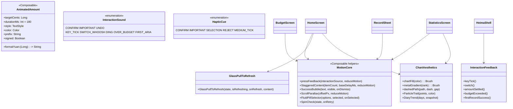
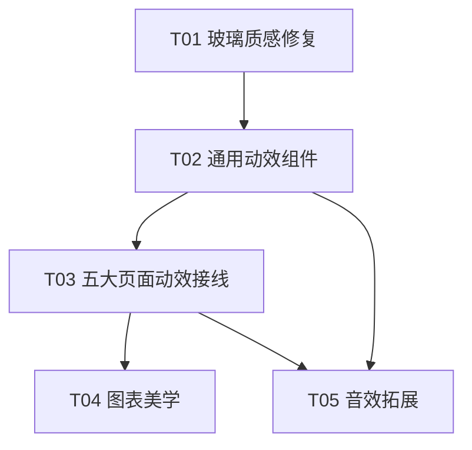

# 黑马记账 · 四期增量架构设计（动效 + UI 美化 + 图标 + 音效拓展）

> 版本：v1.0（架构定稿，可直接交工程师实施）
> 依据：`docs/android/PRD_PHASE4.md`（60 条验收）+ `docs/android/PHASE3_4_PLAN.md`（二、四期整节）+ 主理人 7 项拍板 + 毛玻璃/ SuperDesign 方法论
> 原则：**最小改动优先，但允许新增通用组件文件**；动效全部读 reduceMotion 降级；深色观感不退化。
> 现状基线：一期+二期+三期已交付（玻璃=半透明平板、三图切换已上线、LocalHeimaScrolling 已就位、音效 v2 泛音合成、成功气泡/共享元素过渡未做）。

---

## 一、实现方案总览

| # | 块 | 核心技术点 | 选型与做法 |
|---|----|-----------|-----------|
| 1 | 玻璃质感修复 | backdrop 饱和增强 + 氛围光斑提艳 + 高光加强 | **saturate 用 `colorControls(saturation=1.8f)` 替换现有 `vibrancy()`**（库无 `saturate()`，见下"关键选型结论"）；光斑/高光/阴影给出分浅深具体 alpha 值表 |
| 2 | 五大页面动效 | 通用组件 + 逐页 Composable 映射 | 新增 3 个通用组件文件（`MotionCore.kt` / `GlassPullToRefresh.kt` / `ChartAesthetics.kt`），页面层只做"接线"，不各自造轮子 |
| 3 | 通用动效组件 | AnimatedAmount / pressable / Stagger / 成功气泡 / 视差 / 共享元素 / 下拉刷新 | 统一收敛到新文件；reduceMotion 默认降级；共享元素用官方 `SharedTransitionLayout`（BOM 2026.08 可用，拍板 4 降级 fade） |
| 4 | 图表美学 | 渐变填充 + 金银铜 + 虚线 + 日记式 | 确定性规则（阈值写死）；渐变/金属/虚线/粒子 helper 收敛到 `ChartAesthetics.kt` |
| 5 | 音效拓展 | v2 合成新增 5 cue + 首次琶音 | 沿用 SynthNote/SoundRecipe 体系；"首次"用 SharedPreferences 布尔标记（拍板 5） |
| 6 | 降级 + 深色兼容 | 统一 reduceMotion 分支 | 每个新动效组件内置 `reduceMotion` 短路；深色沿用三期 token 体系 |

**关键选型结论（先查后设计，非臆测）：**

1. **saturate 方案**：`io.github.kyant0:backdrop:2.0.0` **没有 `saturate()` 函数**。官方 API 提供：
   - `colorControls(brightness: Float = 0f, contrast: Float = 1f, saturation: Float = 1f)`（ColorFilter 系，Android 12+，无额外 shader 开销）
   - `vibrancy()` ≡ `colorControls(saturation = 1.5f)`（当前 Glass.kt 正在用）
   - `blur(radius, edgeTreatment)` / `lens(...)`（Android 13+）
   - 效果顺序必须为 **color filter ⇒ blur ⇒ lens**。
   - **结论**：把 `Glass.kt` 的 `vibrancy()` 换成 `colorControls(saturation = 1.8f)` 即可等效 `blur + saturate(180%)`，顺序不变；导入 `com.kyant.backdrop.effects.colorControls`（落地时以 IDE 补全为准）。这是纯 ColorFilter 增强，**不新增 RenderShader 依赖**，Android 12 以下自动被库吞掉（与现 blur 一致）。
2. **共享元素 API 可用性**：`compose-bom = 2026.08.00`（→ compose.animation ≥ 1.7），`androidx.compose.animation.SharedTransitionLayout` / `SharedTransitionScope` / `rememberSharedContentState` / `Modifier.sharedElement` 全部可用。reduceMotion 下降级为 fade（拍板 4）。
3. **图标现状澄清**：`CategoryArtwork` 已是 **3D 图集栅格（`category_3d_atlas_v2`，非单色扁平）**，`CategoryIcon` 已套 radialGradient 圆底 + 描边。故 A7"单色扁平→渐变"的核心已天然满足；四期只需**增量补一个"顶部微高光"层 + 同色族渐变描边环**，无需重画图标。
4. **下拉刷新**：material3（BOM 2026.08）已内置 `PullToRefreshBox`，自定义 header 用它；刷新动作 = `onRefresh: suspend () -> Unit` → 调 `HeimaViewModel` 现有 `refresh()`（重读 repository 状态流），拍板 1。

---

## 二、文件列表

> 路径省略 `apps/android/` 前缀。四期允许新增 **3 个通用组件文件**，其余全部改既有文件。

### 新增文件

| 文件 | 职责 |
|---|---|
| `app/.../ui/MotionCore.kt` | `AnimatedAmount`、`Modifier.pressFeedback`（按压物理）、`StaggeredContent`/`staggerFadeIn`、`SuccessBubble`（成功气泡）、`ScrollParallax`（滚动视差 modifier）、`FluidPillSelector`（三联胶囊流体填充）、`SpinCheck`（检查更新自旋+勾画） |
| `app/.../ui/GlassPullToRefresh.kt` | 自定义下拉刷新 header（圆环进度 + 品牌光弧 + ✓ 描边，`PullToRefreshBox` 封装） |
| `app/.../ui/ChartAesthetics.kt` | 图表渐变填充 `chartFill()`、金银铜金属渐变、折线虚线 path helper、粒子拖尾 helper、"日记式"分组组件 `DiaryTrend` |

### 修改文件

| 文件 | 改动内容 | 关联 |
|---|---|---|
| `core/designsystem/.../Glass.kt` | `vibrancy()`→`colorControls(saturation=1.8f)`；微光边框/rim/顶边高光/sheen alpha 调参；阴影 ambient alpha；`AmbientBackdrop` 光斑提艳 + 新增 2 个大色斑 + 彩带加强；新增 3 个渐变/高光 helper 常量 | 需求 1 |
| `core/designsystem/.../HeimaTheme.kt` | `ambientOne/ambientTwo` 四套主题换更饱和色值（浅色谨慎，见 §3.4 表） | 需求 1 |
| `core/designsystem/.../MotionMaterial.kt` | `HeimaShadowLevel.elevation()` 调 8/16/24dp；新增 `HeimaMotionTokens.bounce/amount/press` 等 spec | 需求 1、3 |
| `app/.../ui/FinanceComponents.kt` | 图表渐变填充、主导切片外推+发光、折线虚线+粒子、`AnimatedBudgetGauge` 双层"能量液"、柱状金银铜 | 需求 4、2(B9/B10/B13) |
| `app/.../ui/CategoryArtwork.kt` | `CategoryIcon` 加顶部微高光层 + 同色族渐变描边环 | 需求 1(A7) |
| `app/.../ui/screens/HomeScreen.kt` | HERO 数字滚动、问候 stagger+辉光、趋势图粒子切换、体检卡 stagger、最近账单 stagger+左滑删除、下拉刷新接线 | B1~B6 |
| `app/.../ui/screens/StatisticsScreen.kt` | 共享元素过渡、总额数字滚动+千分位、环形切片外推+渐变、折线虚线、排行金银铜+竞速+皇冠、选中账单 stagger、日记式 | B7~B12、D5 |
| `app/.../ui/screens/BudgetScreen.kt` | 双层 Gauge 能量液、三联胶囊流体填充、储蓄水流进度条、数字跳动+超支晃动 | B13~B16 |
| `app/.../ui/screens/RecordSheet.kt` | 弹出动画升级、金额橡皮筋、分类选中弹跳+360°描边、键盘 scale+内阴影、保存光带→飞出→气泡 | B17~B21 |
| `app/.../ui/screens/ProfileScreen.kt` | 头像呼吸+视差、主题迷你预览、账本管理 stagger+涟漪、检查更新 spin+勾 | B22~B25 |
| `app/.../ui/InteractionFeedback.kt` | 新增 5 个 `InteractionSound` + `HapticCue.MEDIUM_TICK` + 5 个 `SoundRecipe`；`InteractionFeedback` 新方法 | 需求 5 |
| `app/.../ui/HeimaShell.kt` | 成功气泡 host 接线、首次记账琶音 SharedPreferences 标记、"账单已保存"改气泡 | B21、E5 |
| `app/.../ui/GlassControls.kt` | （可选）`GlassSegmentedControl`/`GlassToggle` 加按压物理 `pressFeedback` | C4 |

---

## 三、数据结构与接口

### 3.1 类图



### 3.2 新增通用组件签名

**`ui/MotionCore.kt`：**

```kotlin
// C1 + B1/B8/B16：数字滚动。spring(阻尼.82, 刚度420)，180ms；reduceMotion → 直接显示终值。
// "千分位分组逐组跳入"由 format 回调实现（B8 传入千分位格式化闭包）。
@Composable
fun AnimatedAmount(
    targetCents: Long,
    modifier: Modifier = Modifier,
    visible: Boolean = true,                     // 隐私遮挡：不可见时显示 ¥••••
    durationMs: Int = 180,
    style: TextStyle,
    color: Color,
    prefix: String = "",
    signed: Boolean = false,
    format: (Long) -> String = { it.formatYuan() },
)

// C4：按压物理 scale 0.97 + 弹性回弹（60~90ms），触控目标由调用方保证 ≥44dp。
@Composable
fun Modifier.pressFeedback(
    interactionSource: MutableInteractionSource,
    reduceMotion: Boolean = HeimaTheme.motion.reduceMotion,
    pressedScale: Float = 0.97f,
): Modifier

// C3：逐项 stagger 入场（每项 baseDelayMs，40~60ms 可调），reduceMotion → 一次性淡入。
@Composable
fun StaggeredContent(
    itemCount: Int,
    modifier: Modifier = Modifier,
    baseDelayMs: Int = 40,
    reduceMotion: Boolean = HeimaTheme.motion.reduceMotion,
    content: @Composable (index: Int) -> Unit,
)

// C6：成功气泡，底部上浮 + ✓ SVG 描边 + 自动淡出（1300ms 后 onDismiss）。
@Composable
fun SuccessBubble(
    text: String,
    visible: Boolean,
    onDismiss: () -> Unit,
    modifier: Modifier = Modifier,
)

// C5：滚动视差（≤6px，反向位移），滚动中禁用（读 LocalHeimaScrolling 省算力）。
@Composable
fun Modifier.scrollParallax(
    scrollOffset: Float,      // 由 listState.firstVisibleItemScrollOffset 传入
    maxShiftPx: Float = 6f,
): Modifier

// B14：三联胶囊，选中项流体填充（高亮从选中方向流入，180ms），reduceMotion → 直接切换。
@Composable
fun <T> FluidPillSelector(
    options: List<Pair<T, String>>,
    selected: T,
    onSelected: (T) -> Unit,
    modifier: Modifier = Modifier,
)

// B25：检查更新状态机动画（IDLE / SPINNING / DONE / ERROR），DONE 用 ✓ 描边，ERROR 晃动。
enum class SpinCheckState { IDLE, SPINNING, DONE, ERROR }
@Composable
fun SpinCheck(state: SpinCheckState, modifier: Modifier = Modifier)
```

**`ui/GlassPullToRefresh.kt`：**

```kotlin
// B6：材料化下拉刷新。isRefreshing 期间跑圆环 + 品牌光弧；成功瞬间 ✓ 描边。
@Composable
fun GlassPullToRefresh(
    isRefreshing: Boolean,
    onRefresh: suspend () -> Unit,     // 拍板 1：调 viewModel.refresh() 重读状态流
    modifier: Modifier = Modifier,
    content: @Composable () -> Unit,   // 内部 LazyColumn
)
// 内部实现：material3 PullToRefreshBox + 自定义 indicator（Canvas 圆环 + 光弧 + ✓ Path 描边动画）
```

**`ui/ChartAesthetics.kt`：**

```kotlin
// D1：顶部亮 → 底部暗的同色族渐变。
fun chartFill(color: Color): Brush =
    Brush.verticalGradient(listOf(lighten(color, .22f), color, darken(color, .14f)))

// D3/B11：金银铜金属渐变（rank: 0=金 1=银 2=铜，其余返回 null 用 chartFill）。
fun metalGradient(rank: Int): Brush?

// D4：虚线 path（点划线 dash 8dp / gap 6dp）——用 PathEffect.dashPathEffect。
fun dashedPathEffect(): PathEffect

// B10：最后数据点粒子拖尾（沿折线末尾回退 6~8 个点，半径递减 + alpha 递减的圆点）。
@Composable
fun ParticleTrail(points: List<Offset>, color: Color, modifier: Modifier = Modifier)

// D5：日记式（拍板 2：本月有消费天数 ≤2 时触发），按天分组的小卡片列。
@Composable
fun DiaryTrend(
    totals: List<DailyTotal>,
    snapshot: LedgerSnapshot,
    amountsVisible: Boolean,
    modifier: Modifier = Modifier,
)
```

**共享元素（`StatisticsScreen.kt` 内，官方 API）：**

```kotlin
// C2/B7：包一层 SharedTransitionLayout；金额数字用 sharedElement；reduceMotion → fade（拍板 4）。
SharedTransitionLayout {
    AnimatedContent(targetState = period) { p ->
        Text(
            ...,
            modifier = if (reduceMotion) Modifier
                else Modifier.sharedElement(
                    rememberSharedContentState(key = "stat_total"),
                    animatedVisibilityScope = this@AnimatedContent,
                ),
        )
    }
}
```

### 3.3 音效新事件（`InteractionFeedback.kt`）

**新增枚举与方法：**

```kotlin
internal enum class InteractionSound { CONFIRM, IMPORTANT, UNDO, KEY_TICK, SWITCH_WHOOSH, DING, OVER_BUDGET, FIRST_ARIA }
internal enum class HapticCue { CONFIRM, IMPORTANT, SELECTION, REJECT, MEDIUM_TICK }

// InteractionFeedback 新方法：
fun keyTick()             // E1：KEY_TICK(声) + SELECTION(轻 tick)
fun switch()              // E2：SWITCH_WHOOSH(声) + MEDIUM_TICK
fun amountSettled()       // E3：DING(仅声，无振)
fun budgetExceeded()      // E4：OVER_BUDGET(声) + IMPORTANT(长振)
fun firstRecordSuccess()  // E5：FIRST_ARIA(琶音) + CONFIRM；由 HeimaShell 用 SharedPreferences 布尔标记门控（全局仅一次，拍板 5）
```

**HapticCue.MEDIUM_TICK** 实现：`HapticFeedbackType.TextHandleMove` 连续两次，间隔 40ms（比 SELECTION 的轻 tick 高一档、比 CONFIRM 低一档）。

**SoundRecipe 参数表（延续 v2：泛音、快速起音 + 指数衰减、微失谐、同族；文件仍写 `-v2.wav`，新增事件用新文件名）：**

| 事件 | 音符序列（频率 / 起始 / 时长 / 泛音族 / 起音 / 衰减系数） | 总时长 | 音量 |
|---|---|---|---|
| KEY_TICK 键盘轻咔 | 1760.00Hz / 0ms / 40ms / BrightPartials / attack 2ms / decayDivisor 2.0 | 40ms | .16 |
| SWITCH_WHOOSH 图表切换嗡 | 220.00Hz / 0ms / 40ms / SoftPartials / attack 3ms / decayDivisor 2.0 | 40ms | .18 |
| DING 数字滚动到位 | 1318.51Hz / 0ms / 130ms / BrightPartials / attack 4ms / decayDivisor 3.4 | 130ms | .24 |
| OVER_BUDGET 预算超额闷响 | 174.61Hz / 0ms / 200ms / SoftPartials / attack 8ms / decayDivisor 3.2 | 200ms | .26 |
| FIRST_ARIA 首次记账琶音 | C5 523.25Hz/0ms/110ms → E5 659.26Hz/70ms/120ms → G5 783.99Hz/140ms/150ms，均 BrightPartials | 290ms | .28 |

**首次记账琶音标记（拍板 5）：** HeimaShell 在 `UiEvent.TransactionSaved` 分支内：

```kotlin
val oncePrefs = remember { context.getSharedPreferences("heima_once_flags", Context.MODE_PRIVATE) }
val played = oncePrefs.getBoolean("first_record_aria_played", false)
if (!played) { oncePrefs.edit(true).putBoolean("first_record_aria_played", true); feedback.firstRecordSuccess() }
else feedback.confirm()
```

### 3.4 玻璃光斑 / 高光 / 阴影具体数值表（分浅/深）

**氛围光斑（`AmbientBackdrop`，需求 A1：alpha 0.35~0.85 + 饱和提升 + 新增 2 大色斑 + 彩带）：**

| 光斑/元素 | 旧 alpha（浅/深） | 新 alpha（浅/深） | 说明 |
|---|---|---|---|
| ambientOne（右上） | .62 / .24 | **.85 / .40** | 主光斑，提艳 |
| ambientTwo（左下） | .42 / .18 | **.60 / .32** | |
| brandSoft（中下） | .32 / .15 | **.45 / .22** | |
| **新增 色斑4 = palette.accent** | — | **.50 / .28** | 更大更亮，位置左上 |
| **新增 色斑5 = palette.brand** | — | **.38 / .20** | 位置右下，面积最大 |
| 彩带（ribbon）白 alpha | .25 / .07 | **.45 / .14** | 线宽 22dp→30dp，更明显 |

**氛围光斑饱和度（`HeimaTheme.kt` 四套主题的 ambientOne/ambientTwo 换更饱和色值）：**

| Token | 主题 | 旧值 | 新值（更饱和） |
|---|---|---|---|
| ambientOne | LiquidLight | `0xFFBFD7FF` | `0xFF9FC4FF` |
| ambientTwo | LiquidLight | `0xFFD7F2FF` | `0xFFB7E6FF` |
| ambientOne | LiquidDark | `0xFF1E3B66` | `0xFF234A80` |
| ambientTwo | LiquidDark | `0xFF1A3A4C` | `0xFF1D4A5E` |
| ambientOne | NatureLight | `0xFFC9DEBA` | `0xFFA9D69A` |
| ambientTwo | NatureLight | `0xFFD9E9D0` | `0xFFBDE8B0` |
| ambientOne | NatureDark | `0xFF2A4C34` | `0xFF30623E` |
| ambientTwo | NatureDark | `0xFF304B38` | `0xFF3A6044` |

> 浅色两套的改动幅度刻意收敛（不破坏三期"浅色零退化"约束，仅提饱和不改变明度基调）；落地后按 A1 截图对比，若浅色显脏则回退浅色、只保留 alpha 提升。

**玻璃高光 / 描边 / 阴影（`Glass.kt` + `MotionMaterial.kt`，A3/A4/A5）：**

| 参数 | 旧（浅/深） | 新（浅/深） |
|---|---|---|
| 顶边高光线（drawLine）alpha | .38 / .30 | **.55 / .50** |
| rim 渐变描边两段 alpha | .72/.36（浅） .30/.18（深） | .72/.40（浅） .34/.22（深） |
| rim 中 brand 段 alpha | .14 | .16（浅） .18（深） |
| sheen 内高光白 alpha | .32 / .045 | .32 / **.07** |
| 微光边框 glassOutline token | 0xD8FFFFFF / 0x40C7DBF7 | 0xD8FFFFFF / **0x5ACFE5FF**（深色勾边更亮） |
| `.shadow` ambient alpha | .16 / .42 | **.22 / .48** |
| `HeimaShadowLevel` | NONE0 / SOFT5 / FLOAT12 / MODAL20 dp | NONE0 / **SOFT8** / **FLOAT16** / **MODAL24** dp |
| `drawBackdrop` Shadow alpha | .28 / .20 | .30 / .24 |

> A3 半透明填充 10~30% 已由 `HeimaMaterialSystem.spec().surfaceAlpha`（.28/.36/.52 等）满足，本期不调；A6 间距 ≥24dp / 圆角 16~24dp：把首页/统计页卡片间距从 18dp 提到 24dp（各 Screen 的 `Arrangement.spacedBy(18.dp)` → `24.dp`），圆角已基本落 22~31dp 区间，仅个别 18/19dp 微调到 ≥20dp。

---

## 四、五大页面逐页落地映射

> 每项 = B 编号 → 改动 Composable（文件）。所有动效读取 reduceMotion，开启时降级为 fade/终态（F1/F2）。

### 首页（HomeScreen.kt）

| 验收 | 动效 | 落地位置 |
|---|---|---|
| B1 | HERO 三数字滚动 + 结余颜色 morph + 放大回弹 | 3 处 `SensitiveAmountText` → `AnimatedAmount`（180ms spring）；结余色用 `animateColorAsState`；数值变化瞬间 `graphicsLayer scale 1.08→1`（spring） |
| B2 | 问候逐字淡入 + 辉光扫过 | 顶部日期 Column：`StaggeredContent`（每字 30ms）；底部一条 `Canvas` 径向渐变横条 `LaunchedEffect(Unit)` 一次 1.2s 左→右（仅每日首次，`rememberSaveable` 标记） |
| B3 | 趋势图粒子切换 | `AnimatedContent` 换自定义：旧图 `ParticleTransition`（0.3s 渐隐+微粒上飘）→ 新图聚合落入（0.4s）；helper 在 `ChartAesthetics.kt`；reduceMotion → 现有 fade |
| B4 | 体检卡指标 stagger + 进度条生长 | 体检卡 4 行改 `StaggeredContent(4, 60ms)`；每行进度条 `animateFloatAsState` 从 0 长到 progress |
| B5 | 最近账单 stagger 入场 + 左滑删除 | `StaggeredContent`（40ms/条）；`TransactionRow` 包 `SwipeToDismissBox`（左滑露删除按钮，spring 回弹；删除时飞出 + alpha→0） |
| B6 | 下拉刷新 | HomeScreen 外层包 `GlassPullToRefresh`；`onRefresh = onRefreshHome`（新参数，HeimaShell 接 `viewModel::refresh`） |

### 统计页（StatisticsScreen.kt）

| 验收 | 动效 | 落地位置 |
|---|---|---|
| B7 | 共享元素过渡 + 环形/柱 12° 旋转入场 | 顶部时段 `SharedTransitionLayout` 包 `AnimatedContent`；金额数字 `sharedElement`；环形/柱 `graphicsLayer rotationZ 12°→0` + fade |
| B8 | 总额数字滚动 + 千分位 | `AnimatedAmount(format = ::formatThousands)` |
| B9 | 主导切片外推 4dp + 发光 + 中心副标 | `AnimatedDonutChart`：slice.ratio>0.85 时偏移 4.dp + 低 alpha 宽描边发光；中心加"占比 NN%"小字 |
| B10 | 折线虚线 + 粒子拖尾 + 径向面积 | `AnimatedTrendChart`：连续 0 天段用 `dashedPathEffect()`；末数据点 `ParticleTrail`；面积 Brush 改径向（中心透明→边缘 12%） |
| B11 | 排行金银铜 + 竞速 + 皇冠 | 分类排行前三用 `metalGradient`；条形 `animateFloatAsState`（120ms，同比率速度）；第 1 名右上 `CrownIcon`（自绘 Canvas 矢量，拍板 3）+ spring 落下 |
| B12 | 选中切片外推 + 账单 stagger 飞入 | 复用 B9 外推；选中账单列表 `StaggeredContent`（右侧 30% 偏移 + fade → 原位） |
| D5 | 日记式 | 有效消费天数 ≤2（拍板 2）时，消费趋势卡改渲染 `DiaryTrend` |

### 预算页（BudgetScreen.kt）

| 验收 | 动效 | 落地位置 |
|---|---|---|
| B13 | 双层 Gauge 能量液 | `AnimatedBudgetGauge` 改双层弧；头部圆点 + `ParticleTrail` 小拖尾；ratio>0.85 变橙 + 轻微脉动（`rememberInfiniteTransition`）；>1.0 变红 + 圆点晃动 |
| B14 | 三联胶囊流体填充 | 模式切换 `GlassSegmentedControl` → `FluidPillSelector`；指标区 `AnimatedContent` fade |
| B15 | 储蓄进度水流 | 进度条内 `rememberInfiniteTransition` 光带 3s 循环（`Brush.linearGradient` 位移）；增长时"推"向前 |
| B16 | 数字跳动 + 超支晃动 | 本月概览 `AnimatedAmount`；超支 `graphicsLayer translationX ±3dp` 一次 spring 回中 |

### 记账弹层（RecordSheet.kt）

| 验收 | 动效 | 落地位置 |
|---|---|---|
| B17 | 弹出：背景模糊 0.3s + 面板 spring 380ms + 内容 stagger 60ms | 背景 scrim 用 `AnimatedVisibility`/alpha + backdrop 模糊（0.3s）；面板 `scale 0.95 + translationY 28dp → 原位`（spring 380ms）；内部 5 块 `StaggeredContent(5, 60ms)` |
| B18 | 金额橡皮筋 | 金额 Text `graphicsLayer scale 1.12→1`（每次按键 spring 150ms）；清空 `scale→0 + fade` |
| B19 | 分类选中弹跳 + 360° 描边 | `CategoryChoice` 选中图标 scale 1.06 spring 200ms + 外圈 `drawArc` 从 0° 扫到 360°（0.25s）；切换旧缩回/新弹出 |
| B20 | 键盘 scale + 内阴影 + 保存光带 | `KeyButton` scale 0.93 + 内阴影；`SaveButton` 长按/点击光带 `Brush` 从左扫右 |
| B21 | 保存光带→飞出→气泡 | 保存成功：光带 0.4s → 面板 `translationY` 飞出（spring 320ms）→ `SuccessBubble("账单已保存 ✓")` |

### 我的页（ProfileScreen.kt）

| 验收 | 动效 | 落地位置 |
|---|---|---|
| B22 | 头像呼吸 + 视差 | 头像卡 `rememberInfiniteTransition` scale 1.0~1.04（4s）；卡 `scrollParallax`（≤6px，滚动中禁） |
| B23 | 主题迷你预览 | `ThemeSwatch` 内画"缩小版首页骨架"（`Canvas` 简化色块）；切换 `animateColorAsState` 0.6s 颜色过渡 |
| B24 | 账本管理 stagger + 涟漪 | `SettingEntry` 列表 `StaggeredContent(50ms)`；点击 `pressFeedback` + 中心扩散圆形高亮（0.2s） |
| B25 | 检查更新 spin + 勾/晃 | 更新按钮 `SpinCheck`（SPINNING 自旋小环 / DONE ✓ 描边 / ERROR 晃动） |

---

## 五、图表美学具体参数（需求 4）

| 规则 | 具体值 | 实现 |
|---|---|---|
| 渐变方向 | 顶亮 → 底暗 | `chartFill(color) = Brush.verticalGradient(lighten(.22), color, darken(.14))` |
| 金银铜（前三名） | 金 `0xFFFFE9A8→0xFFF6C445→0xFFD99116`；银 `0xFFF2F4F7→0xFFC9D1DC→0xFF929DAD`；铜 `0xFFF3C19B→0xFFD98E5F→0xFFB06A3C` | `metalGradient(rank)` |
| 主导切片外推 | ratio > 0.85 时沿角平分线外推 `4.dp` + 发光圈（同色 alpha .25、宽 6dp 的宽描边） | `AnimatedDonutChart` 内 |
| 折线虚线 | 连续 0 天段：`PathEffect.dashPathEffect(floatArrayOf(8.dp, 6.dp))` | `dashedPathEffect()` |
| 折线面积 | 径向渐变 中心透明 → 边缘 12% 透明（`Brush.radialGradient`） | `AnimatedTrendChart` |
| 粒子拖尾 | 末数据点向前回退 6 个点，半径 3.2→0.8dp 递减、alpha .35→0 递减 | `ParticleTrail` |
| 日记式阈值 | 本月有消费天数 ≤ 2（拍板 2） | `DiaryTrend` |
| 深色配色 | 图表色沿用三期已提亮的 `chartColors`；渐变/金属统一在深色下 `lerp(color, White, .12f)` 再提一档 | `chartFill` 内按 `HeimaTheme.motion.darkTheme` 分支 |

---

## 六、任务列表（交工程师执行）

> 共 5 个任务，全部 P0。执行顺序遵守拍板 7：玻璃质感 → 通用组件 → 页面动效 → 图表 → 音效，最终一次性交付。

| 任务 | 名称 | 涉及文件 | 依赖 | 对应验收 |
|---|---|---|---|---|
| **T01** | 玻璃质感修复（光斑提艳 + saturate + 高光/阴影） | `core/designsystem/Glass.kt`、`HeimaTheme.kt`、`MotionMaterial.kt`、`ui/CategoryArtwork.kt` | 无 | A1~A10 |
| **T02** | 通用动效组件（AnimatedAmount/pressable/Stagger/气泡/视差/胶囊/SpinCheck/下拉刷新） | 新增 `ui/MotionCore.kt`、新增 `ui/GlassPullToRefresh.kt`、`ui/GlassControls.kt`（按压物理） | T01（组件读新玻璃 token） | C1~C7 |
| **T03** | 五大页面动效接线（首页/统计/预算/记账/我的） | `HomeScreen.kt`、`StatisticsScreen.kt`、`BudgetScreen.kt`、`RecordSheet.kt`、`ProfileScreen.kt`、`HeimaShell.kt`（成功气泡+刷新回调） | T01、T02 | B1~B25 |
| **T04** | 图表美学（渐变/金银铜/虚线/粒子/日记式/能量液/水流） | 新增 `ui/ChartAesthetics.kt`、`ui/FinanceComponents.kt` | T02（复用 AnimatedAmount/Stagger）、T03（页面已接线） | D1~D7 |
| **T05** | 音效拓展（5 新 cue + 首次琶音） | `ui/InteractionFeedback.kt`、`ui/HeimaShell.kt`（首次标记）、`ui/screens/RecordSheet.kt`（键盘/保存音接线）、`ui/screens/StatisticsScreen.kt`/`BudgetScreen.kt`（图表切换/超额接线） | T02、T03 | E1~E9 |

**任务依赖图：**



**逐步自检（拍板 7）**：每完成一个任务跑 `gradlew.bat :app:assembleDebug`；T01 先真机主观确认玻璃观感，T03 逐页确认动效，T04 确认图表，T05 确认音效；最终一次性打 APK 交付。

---

## 七、共享约定

1. **动效统一走 reduceMotion**：任何新增动画第一行必须 `val reduceMotion = HeimaTheme.motion.reduceMotion`，开启时降级为 fade（≤90ms）或直接终态；禁止位移/旋转/粒子/无限循环在 reduceMotion 下保留（F1）。
2. **通用组件优先**：页面层只做"接线"，动画实现收敛到 `MotionCore.kt` / `ChartAesthetics.kt` / `GlassPullToRefresh.kt`；禁止在各 Screen 内重复手写 spring/fade 参数。
3. **玻璃 Token 是唯一真相**：saturate/光斑/高光/阴影参数只在 `Glass.kt`/`HeimaTheme.kt`/`MotionMaterial.kt` 改，页面不硬编码 alpha 值。
4. **图表规则确定性**：主导切片外推阈值（>85%）、金银铜名次（前三）、虚线（连续 0 天）、日记式（≤2 天）全部常量集中定义，QA 可对表验证（D 系列）。
5. **音效同族**：新事件必须复用 `SynthNote + SoundRecipe + BrightPartials/SoftPartials` 体系，禁止引入纯单频正弦波或音频资源文件（E7）；新 cue 文件名 `-v2.wav`（或新后缀）确保缓存刷新。
6. **首次琶音唯一来源**：`heima_once_flags.first_record_aria_played` 布尔，只在 HeimaShell 读写，其余地方不判断"首次"（拍板 5）。
7. **性能预算**：所有 `rememberInfiniteTransition`（呼吸/水流/光带）必须挂 `reduceMotion` 短路；粒子/拖尾只在切换瞬间触发、不在滚动中运行；滚动感知复用三期 `LocalHeimaScrolling`。验收沿用三期基线 P95≤16ms、janky≤5%，新增首页冷启动 ≤1.5s（拍板 6、F5）。
8. **深浅色同参数**：所有新 alpha/色值都需给浅/深两档（表格化），禁止只调浅色不管深色（F3）；关闭 Liquid Glass 后动效仍正常、无玻璃残留（F6）。
9. **触控目标**：所有可点元素 ≥44dp（新增小图标切换器/胶囊/自旋环不例外），按压反馈用 `pressFeedback`。

---

## 八、风险点 + 待明确事项

### 风险点
1. **saturate 兼容边界**：`colorControls` 是 ColorFilter 系（Android 12+），低于 12 时被库静默跳过（与现 blur 一致）——四期玻璃在 Android 12 以下设备上"无饱和增强"，属可接受的渐进降级（minSdk 29，覆盖 Android 10/11 低端机）。需真机确认 12+ 设备饱和观感。
2. **浅色氛围光斑改动**：三期承诺"浅色零退化"，四期对 LiquidLight/NatureLight 的 ambient 色值仅提饱和、不动明度基调，但仍有"显脏"风险——落地后若浅色观感变差，回退浅色、只保留 alpha 提升（已在 §3.4 标注）。
3. **性能**：粒子过渡/水流/呼吸/光带等新增 `rememberInfiniteTransition`，若遗漏 reduceMotion 短路或滚动中不暂停，会拖慢滚动、破坏三期 F5 基线。T03/T04 完成后必须真机回归帧率。
4. **成功气泡与现有 Snackbar 竞态**：`UiEvent.TransactionSaved` 现走 `feedback.confirm() + snackbar.showSnackbar("账单已保存")`，四期改气泡后需移除该 snackbar 调用，避免"气泡+Snackbar"叠显；撤销/错误类仍走 Snackbar。
5. **共享元素降级**：`sharedElement` 在 reduceMotion 下退化为 fade（拍板 4），但 `SharedTransitionLayout` 本身不能条件移除（需始终包裹），实现时用"包裹保持 + 元素 Modifier 条件切换"而非条件包 Layout，避免重组崩溃。

### 待明确事项
1. **"微光边框白 0.2~0.3"的语义**：现有 `.border` 微光边框在浅色已是 0x85 白（远高于 0.3），深色 0x40 偏弱。设计按"深色提亮到 0.35、浅色维持现状"落地（A4 核心是深色下看得见）；若主理人坚持浅色也降到 0.2~0.3，则浅色玻璃边框会明显变淡、与三期观感不同，需再议。
2. **下拉刷新的 loading 时长**：拍板 1 要求"真实重算 + loading 动效"，`viewModel.refresh()` 为内存态重读、几乎瞬时，loading 动效若太快会"一闪而过"。设计为**最短展示 600ms**（人为 floor）保证动效可感知；是否需要 floor、floor 多少待拍板。
3. **千分位动画（B8）**：`formatYuan` 现无千分位分隔，B8"按千分位分组逐组跳入"需要新的金额格式化函数（`¥1,234.56`）。是否全局金额都加千分位（影响首页/账单/统计所有金额显示），还是仅统计页总额？默认"仅统计页总额 + 首页大数字"，其余维持现状，待确认。
4. **左滑删除（B5）与现有点击进编辑（HomeScreen 最近账单）的冲突**：`SwipeToDismissBox` 会拦截横向手势，需确认左滑删除是否纳入首页"最近账单"（现点击是打开编辑弹层）——默认首页最近账单启用左滑删除，点击仍进编辑，两条手势并存，待确认。
5. **主题迷你预览（B23）的骨架保真度**：纯 `Canvas` 色块骨架 vs 复用真实首页 Composable 缩略。默认色块骨架（省力、无交互），若主理人要求"真实预览"则需抽首页骨架组件，工作量增加约 0.5 天。
